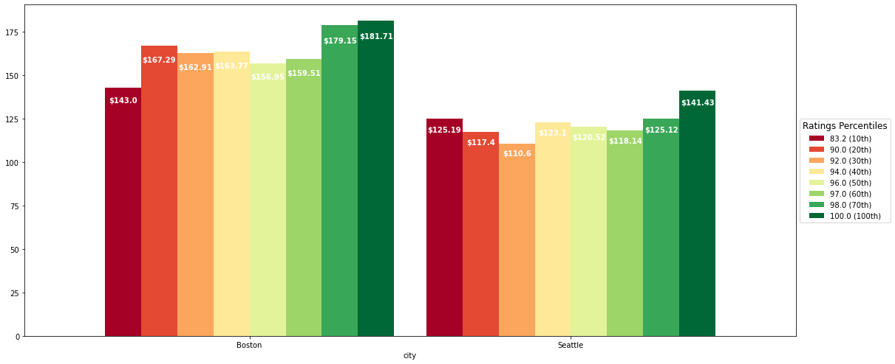
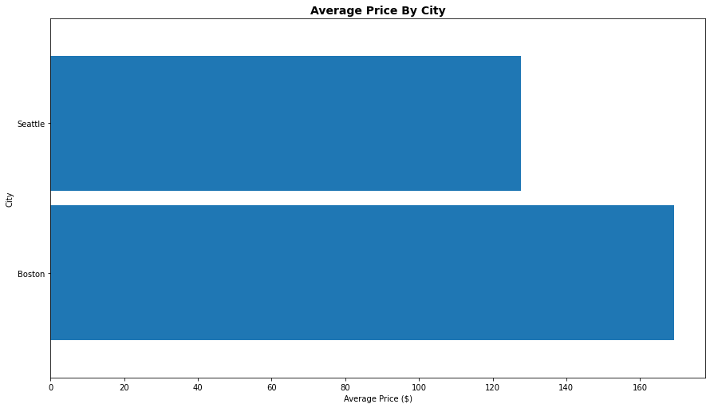
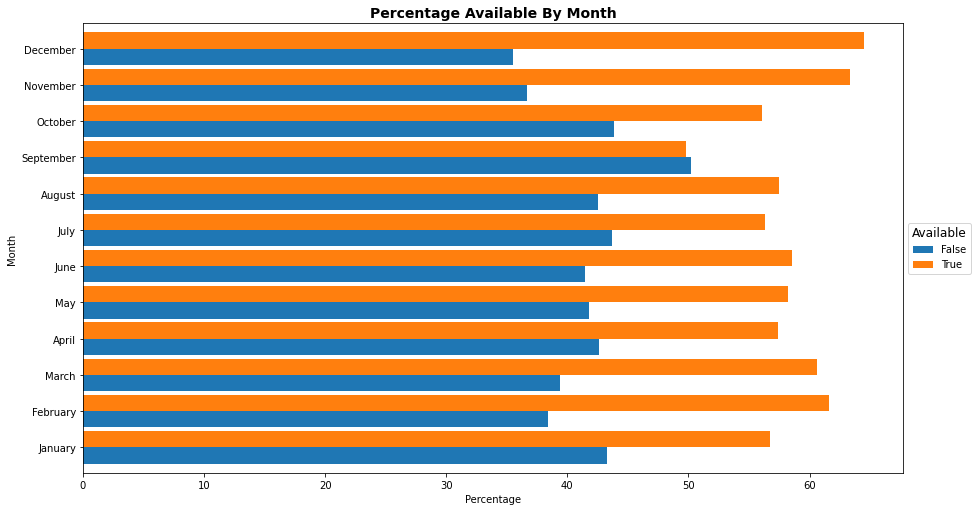
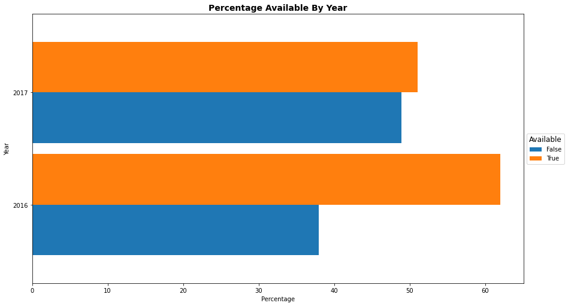
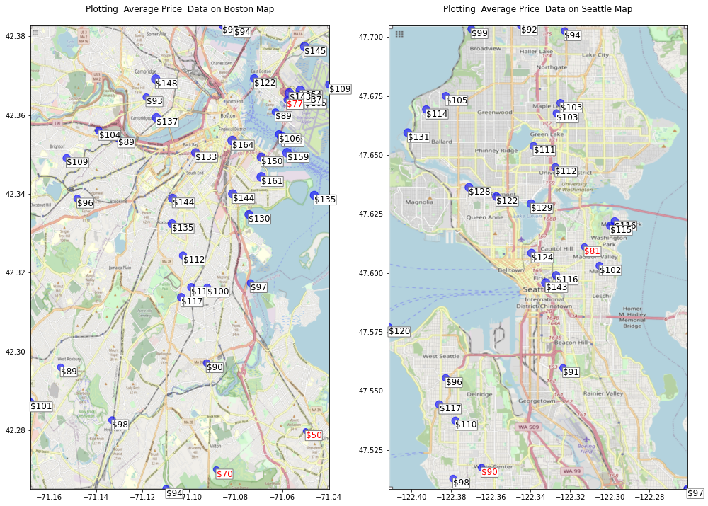
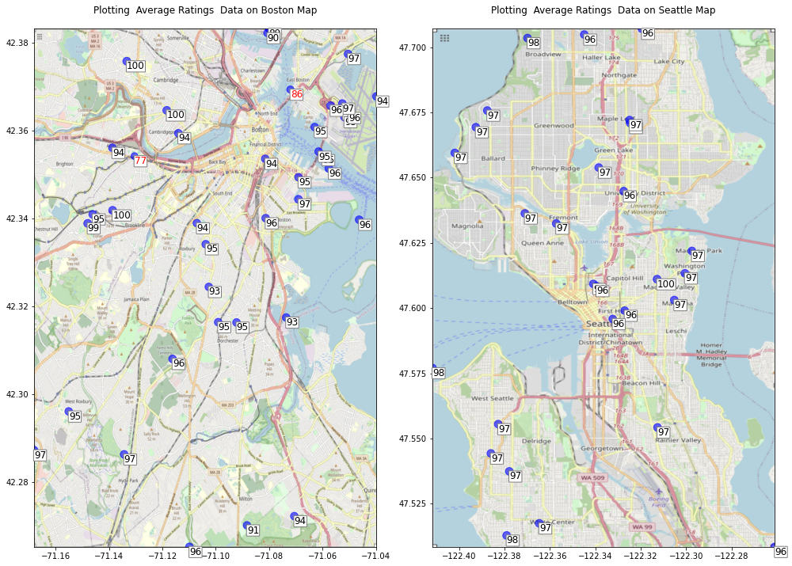

# AirBnB - A Sentiment Analysis

# Introduction

## [What is Airbnb and how does it work?](https://www.airbnb.com/help/article/2503/what-is-airbnb-and-how-does-it-work)
#### A community built on sharing
_"Airbnb began in 2008 when two designers who had space to share hosted three travelers looking for a place to stay. Now, millions of hosts and travelers choose to create a free Airbnb account so they can list their space and book unique accommodations anywhere in the world. And Airbnb experience hosts share their passions and interests with both travelers and locals."_

#### Trusted services
_"Airbnb helps make sharing easy, enjoyable, and safe. We verify personal profiles and listings, maintain a smart messaging system so hosts and guests can communicate with certainty, and manage a trusted platform to collect and transfer payments._"

## What Information Do We Have?
The source of the data is [kaggle.com](kaggle.com). The data used in this analysis is for two cities:
1. [Boston](https://www.kaggle.com/airbnb/boston)
2. [Seattle](https://www.kaggle.com/airbnb/seattle/data)

<form action="javascript:code_toggle()"><input type="submit" value="Toggle Code"></form>

Rows and columns in: calendar (2702460, 5), listings (7403, 95), reviews (153124, 7)

Unique listing ids in listings 7403

Columns in: calendar: Listing Id, Date, Available, Price, City,
          listings: Id, Listing Url, Scrape Id, Last Scraped, Name, Summary, Space, Description, Experiences Offered, Neighborhood Overview, Notes, Transit, Access, Interaction, House Rules, Thumbnail Url, Medium Url, Picture Url, Xl Picture Url, Host Id, Host Url, Host Name, Host Since, Host Location, Host About, Host Response Time, Host Response Rate, Host Acceptance Rate, Host Is Superhost, Host Thumbnail Url, Host Picture Url, Host Neighbourhood, Host Listings Count, Host Total Listings Count, Host Verifications, Host Has Profile Pic, Host Identity Verified, Street, Neighbourhood, Neighbourhood Cleansed, Neighbourhood Group Cleansed, City, State, Zipcode, Market, Smart Location, Country Code, Country, Latitude, Longitude, Is Location Exact, Property Type, Room Type, Accommodates, Bathrooms, Bedrooms, Beds, Bed Type, Amenities, Square Feet, Price, Weekly Price, Monthly Price, Security Deposit, Cleaning Fee, Guests Included, Extra People, Minimum Nights, Maximum Nights, Calendar Updated, Has Availability, Availability 30, Availability 60, Availability 90, Availability 365, Calendar Last Scraped, Number Of Reviews, First Review, Last Review, Review Scores Rating, Review Scores Accuracy, Review Scores Cleanliness, Review Scores Checkin, Review Scores Communication, Review Scores Location, Review Scores Value, Requires License, License, Jurisdiction Names, Instant Bookable, Cancellation Policy, Require Guest Profile Picture, Require Guest Phone Verification, Calculated Host Listings Count, Reviews Per Month,
          reviews: Listing Id, Id, Date, Reviewer Id, Reviewer Name, Comments, City

The listings id variable is a unique identifier (number of unique entries for each id: [1]

    93.31600201918224

    count   5943.00
    mean      93.32
    std        8.21
    min       20.00
    0%        20.00
    10%       83.20
    20%       90.00
    30%       92.00
    40%       94.00
    50%       96.00
    60%       97.00
    70%       98.00
    80%      100.00
    90%      100.00
    100%     100.00
    max      100.00
    Name: review_scores_rating, dtype: float64

    [20.0, 83.2, 90.0, 92.0, 94.0, 96.0, 97.0, 98.0, 100.0] ['0%', '10%', '20%', '30%', '40%', '50%', '60%', '70%', '100%']

    

    

    city
    Boston    91.92
    Seattle   94.54
    Name: review_scores_rating, dtype: float64

    city
    Boston    9.43
    Seattle   9.64
    Name: review_scores_accuracy, dtype: float64

    <class 'pandas.core.frame.DataFrame'>
    RangeIndex: 7403 entries, 0 to 7402
    Data columns (total 96 columns):
     #   Column                            Non-Null Count  Dtype   
    ---  ------                            --------------  -----   
     0   id                                7403 non-null   int64   
     1   listing_url                       7403 non-null   object  
     2   scrape_id                         7403 non-null   int64   
     3   last_scraped                      7403 non-null   object  
     4   name                              7403 non-null   object  
     5   summary                           7083 non-null   object  
     6   space                             5777 non-null   object  
     7   description                       7403 non-null   object  
     8   experiences_offered               7403 non-null   object  
     9   neighborhood_overview             4956 non-null   object  
     10  notes                             3822 non-null   object  
     11  transit                           5179 non-null   object  
     12  access                            2096 non-null   object  
     13  interaction                       2031 non-null   object  
     14  house_rules                       2393 non-null   object  
     15  thumbnail_url                     6484 non-null   object  
     16  medium_url                        6484 non-null   object  
     17  picture_url                       7403 non-null   object  
     18  xl_picture_url                    6484 non-null   object  
     19  host_id                           7403 non-null   int64   
     20  host_url                          7403 non-null   object  
     21  host_name                         7401 non-null   object  
     22  host_since                        7401 non-null   object  
     23  host_location                     7384 non-null   object  
     24  host_about                        5235 non-null   object  
     25  host_response_time                6409 non-null   object  
     26  host_response_rate                6409 non-null   object  
     27  host_acceptance_rate              6159 non-null   object  
     28  host_is_superhost                 7401 non-null   object  
     29  host_thumbnail_url                7401 non-null   object  
     30  host_picture_url                  7401 non-null   object  
     31  host_neighbourhood                6764 non-null   object  
     32  host_listings_count               7401 non-null   float64 
     33  host_total_listings_count         7401 non-null   float64 
     34  host_verifications                7403 non-null   object  
     35  host_has_profile_pic              7401 non-null   object  
     36  host_identity_verified            7401 non-null   object  
     37  street                            7403 non-null   object  
     38  neighbourhood                     6444 non-null   object  
     39  neighbourhood_cleansed            7403 non-null   object  
     40  neighbourhood_group_cleansed      3818 non-null   object  
     41  city                              7403 non-null   object  
     42  state                             7403 non-null   object  
     43  zipcode                           7358 non-null   object  
     44  market                            7389 non-null   object  
     45  smart_location                    7403 non-null   object  
     46  country_code                      7403 non-null   object  
     47  country                           7403 non-null   object  
     48  latitude                          7403 non-null   float64 
     49  longitude                         7403 non-null   float64 
     50  is_location_exact                 7403 non-null   object  
     51  property_type                     7399 non-null   object  
     52  room_type                         7403 non-null   object  
     53  accommodates                      7403 non-null   int64   
     54  bathrooms                         7373 non-null   float64 
     55  bedrooms                          7387 non-null   float64 
     56  beds                              7393 non-null   float64 
     57  bed_type                          7403 non-null   object  
     58  amenities                         7403 non-null   object  
     59  square_feet                       153 non-null    float64 
     60  price                             7403 non-null   float64 
     61  weekly_price                      2901 non-null   object  
     62  monthly_price                     2405 non-null   object  
     63  security_deposit                  3208 non-null   object  
     64  cleaning_fee                      5266 non-null   object  
     65  guests_included                   7403 non-null   int64   
     66  extra_people                      7403 non-null   object  
     67  minimum_nights                    7403 non-null   int64   
     68  maximum_nights                    7403 non-null   int64   
     69  calendar_updated                  7403 non-null   object  
     70  has_availability                  3818 non-null   object  
     71  availability_30                   7403 non-null   int64   
     72  availability_60                   7403 non-null   int64   
     73  availability_90                   7403 non-null   int64   
     74  availability_365                  7403 non-null   int64   
     75  calendar_last_scraped             7403 non-null   object  
     76  number_of_reviews                 7403 non-null   int64   
     77  first_review                      6020 non-null   object  
     78  last_review                       6020 non-null   object  
     79  review_scores_rating              5943 non-null   float64 
     80  review_scores_accuracy            5922 non-null   float64 
     81  review_scores_cleanliness         5932 non-null   float64 
     82  review_scores_checkin             5925 non-null   float64 
     83  review_scores_communication       5934 non-null   float64 
     84  review_scores_location            5926 non-null   float64 
     85  review_scores_value               5926 non-null   float64 
     86  requires_license                  7403 non-null   object  
     87  license                           0 non-null      float64 
     88  jurisdiction_names                3818 non-null   object  
     89  instant_bookable                  7403 non-null   object  
     90  cancellation_policy               7403 non-null   object  
     91  require_guest_profile_picture     7403 non-null   object  
     92  require_guest_phone_verification  7403 non-null   object  
     93  calculated_host_listings_count    7403 non-null   int64   
     94  reviews_per_month                 6020 non-null   float64 
     95  Review Scores Rating Percentiles  5943 non-null   category
    dtypes: category(1), float64(18), int64(13), object(64)
    memory usage: 5.4+ MB

#### Is there information in the calendar or reviews data files that would be useful?

<table border="1" class="dataframe">
  <thead>
    <tr style="text-align: right;">
      <th></th>
      <th>listing_id</th>
      <th>date</th>
      <th>available</th>
      <th>price</th>
      <th>city</th>
    </tr>
  </thead>
  <tbody>
    <tr>
      <th>1745383</th>
      <td>8029177</td>
      <td>2016-11-17</td>
      <td>t</td>
      <td>$100.00</td>
      <td>Seattle</td>
    </tr>
    <tr>
      <th>809330</th>
      <td>3992208</td>
      <td>2017-02-12</td>
      <td>t</td>
      <td>$99.00</td>
      <td>Boston</td>
    </tr>
    <tr>
      <th>1739914</th>
      <td>8248970</td>
      <td>2016-11-23</td>
      <td>t</td>
      <td>$250.00</td>
      <td>Seattle</td>
    </tr>
    <tr>
      <th>338306</th>
      <td>6992859</td>
      <td>2016-10-24</td>
      <td>t</td>
      <td>$399.00</td>
      <td>Boston</td>
    </tr>
    <tr>
      <th>895431</th>
      <td>7325063</td>
      <td>2017-06-03</td>
      <td>t</td>
      <td>$249.00</td>
      <td>Boston</td>
    </tr>
  </tbody>
</table>

<table border="1" class="dataframe">
  <thead>
    <tr style="text-align: right;">
      <th></th>
      <th>listing_id</th>
      <th>id</th>
      <th>date</th>
      <th>reviewer_id</th>
      <th>reviewer_name</th>
      <th>comments</th>
      <th>city</th>
    </tr>
  </thead>
  <tbody>
    <tr>
      <th>35234</th>
      <td>3554558</td>
      <td>39597781</td>
      <td>2015-07-25</td>
      <td>25516459</td>
      <td>Natalie</td>
      <td>Both Jacqueline and the apartment were fantastic. Jacqueline was very kind and responsive throughout the entire process. The apartment was clean, beautiful, and in a great location. We would certainly stay again.</td>
      <td>Seattle</td>
    </tr>
    <tr>
      <th>148230</th>
      <td>10083878</td>
      <td>69323984</td>
      <td>2016-04-10</td>
      <td>65261946</td>
      <td>Kathy</td>
      <td>Jen and Ted are great hosts.  Their place is well appointed and very spacious.  You won’t be disappointed with all the amenities, industrial décor and the convenient location in the South End.  They also can give you all sorts of ideas on where to eat in the area.  We would definitely stay at their place in the future.</td>
      <td>Boston</td>
    </tr>
    <tr>
      <th>2996</th>
      <td>741699</td>
      <td>9263232</td>
      <td>2013-12-16</td>
      <td>2119646</td>
      <td>Eugene</td>
      <td>The Zen Retreat is tastefully decorated and exactly what I needed after two days of running around Seattle trying to take in all the sights. Matt was the consummate host and even put out some sparkling water on the beds for us to enjoy. Would recommend to anyone visiting the Seattle area!</td>
      <td>Seattle</td>
    </tr>
    <tr>
      <th>16878</th>
      <td>2186330</td>
      <td>26021085</td>
      <td>2015-02-01</td>
      <td>17466272</td>
      <td>Heather</td>
      <td>My husband and son stayed in the condo and had a great time. Parking was requested, the stalls are quite small.  The beds were comfortable and the washer and dryer was definitely a plus. Thank you!</td>
      <td>Seattle</td>
    </tr>
    <tr>
      <th>111733</th>
      <td>2747654</td>
      <td>52233038</td>
      <td>2015-10-27</td>
      <td>18561373</td>
      <td>Kate</td>
      <td>Great location, vibrant part of Boston and walking distance to most sights in Boston. Comfortable bed for two with our adult son catered for with a pullout couch. \nNoisy and light due to busy street but busy days and ear plugs and eye covers gave us good nights sleep.</td>
      <td>Boston</td>
    </tr>
  </tbody>
</table>

To create all of the required pickle files took 1835.31 seconds, or 30.59 minutes

    16

    

    

Sean und seine Frau Clara sind sehr freundliche, aufmerksame und hilfsbereite Gastgeber. Sie bringen ihren Gästen großes Vertrauen entgegen. Schlafzimmer und Badezimmer waren gepflegt und großzügig. Als Mitbenutzer der Küche und des Wohnzimmers fühlten wir uns willkommen. Sean ist so freundlich, mein Fahrrad in seiner Garage aufzubewahren, solange ich durch Kanada reise. Ich kann diese Gastgeber nur weiter empfehlen. Uwe Gerischer

    

    

Julie is a fantastic host. She greeted me warmly and answered all of my questions as I had them. What stands out for me is that she offered to get anything I needed for the mother-in-law unit (an extra trashcan, a microwave, blankets, etc.). She made sure that I was comfortable and felt welcomed. 

Something to be aware of is that the pictures are of a stock townhome from this complex but the place is nearly identical. As mentioned in previous reviews, there is no carpet in the bedroom. However, the bedroom and living room above it have its own separate climate control. Because of that, part of the floor is heated! 

Julie's home is clean with minimal decorations and a modern feel. The neighborhood is quiet and safe; it is within walking distance to bus stops and downtown. There's also lots of coffee shops, restaurants, and bars a few blocks away. It's a great, secure location. For nights in, the WiFi is incredibly fast and the bed is soft and very comfortable. The view from the roof is to die for. 

While Julie was often busy with work and her personal life, it was always a pleasure to speak with her at the end of the day. This is a great place and I highly recommend renting from her! 

We contacted Rob and he has great communication with us on the details of the place. We decided to book it. At the time of check-in, Rob came greet us and explained about the room. The room was very nice and clean as we expected. It is like what is in the pictures. We love the location of this room as it is close to everything such as highway and attractions. There are some coffee shops and grocery stores around the places. So far, we really enjoyed our stay.

    

    

    1.777509068923821

Comments Number 0

 my phone gps was not aware that some streets behind safeway don't "go all the way through" due to open land  (dead ends) without roads so if you're walking (esp.

Comments Number 1

  i had rented a car and quickly found that parking in seattle can be something of an ordeal, but carol's house is located towards the end of a dead end street with so few houses on it that you'll always have a place to park for the night.

Comments Number 2

 
i was on a work trip so i was normally dead tired when i got back each night so i was very happy with the space and privacy they gave us.

Comments Number 3

 also, all of the smoke detectors were dead and required new 9 volt batteries, to prevent them from beeping all night long, which we happily replaced.

Comments Number 4

as we got nearer to check in, sid was helpful to welcome me & text me the directions/instructions because my phone was almost dead & unable to access internet.

Comments Number 5

 you are dead in the center of belltown which has a ton of restaurants within a couple blocks so that was awesome.

Comments Number 6

 the whole process was dead simple.

Comments Number 7

 location is dead central, 5min walk from the space needle and the not-to-be-missed music museum.

Comments Number 8

 the dead flowers in several of the windows add to the atmosphere (in a creepy way).

Comments Number 9

 others are aesthetic: consolidate single toiletry bottles (or buy a new $3 bottle of suave every guest stay or two), toss the dead plants on the fire escape, use white/clear bulbs, paint over ceiling stains instead of smearing a dirty cloth over them.

#### Time Taken
        Grouped by city, english language only: Time Taken: 303.38720989227295 seconds
                            loaded from pickle: Time Taken: 15.748566150665283 seconds

<h2>Decision About Merging</h2)

    None

#### Do the dataframes include the same listings?

    []

    []

    []

There are 1383 listings that are not included in the reviews dataframe. That is 18.68%.
This matches the missing reviews from the listings dataframe (i.e. where Number of Listings is zero): 1383

All listings, in the listings data, are in the calendar data file. But close to 19% are missing from the reviews data.

    ['number_of_reviews',
     'first_review',
     'last_review',
     'review_scores_rating',
     'review_scores_accuracy',
     'review_scores_cleanliness',
     'review_scores_checkin',
     'review_scores_communication',
     'review_scores_location',
     'review_scores_value',
     'reviews_per_month',
     'Review Scores Rating Percentiles']

    1383

    

    

    count   7403.00
    mean     147.80
    std      102.89
    min        0.00
    0%         0.00
    10%       55.00
    20%       70.00
    30%       85.00
    40%      100.00
    50%      120.00
    60%      145.00
    70%      170.00
    80%      200.00
    90%      275.00
    100%     999.00
    max      999.00
    Name: price, dtype: float64

    

    

    

    

    

    

              city_merge
              Boston    127.976
              Seattle   173.926
              Name: price, dtype: float64

<table border="1" class="dataframe">
  <thead>
    <tr style="text-align: right;">
      <th></th>
      <th>count</th>
      <th>mean</th>
      <th>std</th>
      <th>min</th>
      <th>25%</th>
      <th>50%</th>
      <th>75%</th>
      <th>max</th>
    </tr>
  </thead>
  <tbody>
    <tr>
      <th>listing_id</th>
      <td>2702460.00</td>
      <td>6950804.94</td>
      <td>4052439.85</td>
      <td>3335.00</td>
      <td>3865312.75</td>
      <td>7035369.00</td>
      <td>9504211.25</td>
      <td>14933461.00</td>
    </tr>
    <tr>
      <th>price</th>
      <td>1577579.00</td>
      <td>162.60</td>
      <td>143.70</td>
      <td>10.00</td>
      <td>79.00</td>
      <td>120.00</td>
      <td>200.00</td>
      <td>7163.00</td>
    </tr>
    <tr>
      <th>year</th>
      <td>2702460.00</td>
      <td>2016.33</td>
      <td>0.47</td>
      <td>2016.00</td>
      <td>2016.00</td>
      <td>2016.00</td>
      <td>2017.00</td>
      <td>2017.00</td>
    </tr>
  </tbody>
</table>

<table border="1" class="dataframe">
  <thead>
    <tr style="text-align: right;">
      <th></th>
      <th>count</th>
      <th>mean</th>
      <th>std</th>
      <th>min</th>
      <th>25%</th>
      <th>50%</th>
      <th>75%</th>
      <th>max</th>
    </tr>
  </thead>
  <tbody>
    <tr>
      <th>id</th>
      <td>7403.00</td>
      <td>6950001.48</td>
      <td>4052396.78</td>
      <td>3335.00</td>
      <td>3864099.50</td>
      <td>7035240.00</td>
      <td>9500804.00</td>
      <td>14933461.00</td>
    </tr>
    <tr>
      <th>scrape_id</th>
      <td>7403.00</td>
      <td>20160492479532.68</td>
      <td>400929617.51</td>
      <td>20160104002432.00</td>
      <td>20160104002432.00</td>
      <td>20160104002432.00</td>
      <td>20160906204935.00</td>
      <td>20160906204935.00</td>
    </tr>
    <tr>
      <th>host_id</th>
      <td>7403.00</td>
      <td>20210534.87</td>
      <td>19623093.35</td>
      <td>4193.00</td>
      <td>4343163.50</td>
      <td>14486505.00</td>
      <td>30283594.00</td>
      <td>93854106.00</td>
    </tr>
    <tr>
      <th>host_listings_count</th>
      <td>7401.00</td>
      <td>32.22</td>
      <td>123.59</td>
      <td>0.00</td>
      <td>1.00</td>
      <td>1.00</td>
      <td>4.00</td>
      <td>749.00</td>
    </tr>
    <tr>
      <th>host_total_listings_count</th>
      <td>7401.00</td>
      <td>32.22</td>
      <td>123.59</td>
      <td>0.00</td>
      <td>1.00</td>
      <td>1.00</td>
      <td>4.00</td>
      <td>749.00</td>
    </tr>
    <tr>
      <th>latitude</th>
      <td>7403.00</td>
      <td>45.07</td>
      <td>2.64</td>
      <td>42.24</td>
      <td>42.35</td>
      <td>47.54</td>
      <td>47.62</td>
      <td>47.73</td>
    </tr>
    <tr>
      <th>longitude</th>
      <td>7403.00</td>
      <td>-97.52</td>
      <td>25.61</td>
      <td>-122.42</td>
      <td>-122.33</td>
      <td>-122.28</td>
      <td>-71.08</td>
      <td>-71.00</td>
    </tr>
    <tr>
      <th>accommodates</th>
      <td>7403.00</td>
      <td>3.20</td>
      <td>1.89</td>
      <td>1.00</td>
      <td>2.00</td>
      <td>2.00</td>
      <td>4.00</td>
      <td>16.00</td>
    </tr>
    <tr>
      <th>bathrooms</th>
      <td>7373.00</td>
      <td>1.24</td>
      <td>0.55</td>
      <td>0.00</td>
      <td>1.00</td>
      <td>1.00</td>
      <td>1.00</td>
      <td>8.00</td>
    </tr>
    <tr>
      <th>bedrooms</th>
      <td>7387.00</td>
      <td>1.28</td>
      <td>0.82</td>
      <td>0.00</td>
      <td>1.00</td>
      <td>1.00</td>
      <td>2.00</td>
      <td>7.00</td>
    </tr>
    <tr>
      <th>beds</th>
      <td>7393.00</td>
      <td>1.67</td>
      <td>1.08</td>
      <td>0.00</td>
      <td>1.00</td>
      <td>1.00</td>
      <td>2.00</td>
      <td>16.00</td>
    </tr>
    <tr>
      <th>square_feet</th>
      <td>153.00</td>
      <td>856.03</td>
      <td>647.19</td>
      <td>0.00</td>
      <td>420.00</td>
      <td>770.00</td>
      <td>1200.00</td>
      <td>3000.00</td>
    </tr>
    <tr>
      <th>price</th>
      <td>7403.00</td>
      <td>147.80</td>
      <td>102.89</td>
      <td>0.00</td>
      <td>79.00</td>
      <td>120.00</td>
      <td>189.00</td>
      <td>999.00</td>
    </tr>
    <tr>
      <th>guests_included</th>
      <td>7403.00</td>
      <td>1.56</td>
      <td>1.20</td>
      <td>0.00</td>
      <td>1.00</td>
      <td>1.00</td>
      <td>2.00</td>
      <td>15.00</td>
    </tr>
    <tr>
      <th>minimum_nights</th>
      <td>7403.00</td>
      <td>2.76</td>
      <td>13.24</td>
      <td>1.00</td>
      <td>1.00</td>
      <td>2.00</td>
      <td>3.00</td>
      <td>1000.00</td>
    </tr>
    <tr>
      <th>maximum_nights</th>
      <td>7403.00</td>
      <td>14313.37</td>
      <td>1162232.13</td>
      <td>1.00</td>
      <td>95.50</td>
      <td>1125.00</td>
      <td>1125.00</td>
      <td>99999999.00</td>
    </tr>
    <tr>
      <th>availability_30</th>
      <td>7403.00</td>
      <td>12.85</td>
      <td>12.07</td>
      <td>0.00</td>
      <td>0.00</td>
      <td>10.00</td>
      <td>26.00</td>
      <td>30.00</td>
    </tr>
    <tr>
      <th>availability_60</th>
      <td>7403.00</td>
      <td>29.56</td>
      <td>23.84</td>
      <td>0.00</td>
      <td>1.00</td>
      <td>31.00</td>
      <td>55.00</td>
      <td>60.00</td>
    </tr>
    <tr>
      <th>availability_90</th>
      <td>7403.00</td>
      <td>48.63</td>
      <td>35.01</td>
      <td>0.00</td>
      <td>7.00</td>
      <td>56.00</td>
      <td>84.00</td>
      <td>90.00</td>
    </tr>
    <tr>
      <th>availability_365</th>
      <td>7403.00</td>
      <td>213.09</td>
      <td>138.34</td>
      <td>0.00</td>
      <td>77.00</td>
      <td>259.00</td>
      <td>347.00</td>
      <td>365.00</td>
    </tr>
    <tr>
      <th>number_of_reviews</th>
      <td>7403.00</td>
      <td>20.68</td>
      <td>36.73</td>
      <td>0.00</td>
      <td>1.00</td>
      <td>7.00</td>
      <td>23.00</td>
      <td>474.00</td>
    </tr>
    <tr>
      <th>review_scores_rating</th>
      <td>5943.00</td>
      <td>93.32</td>
      <td>8.21</td>
      <td>20.00</td>
      <td>91.00</td>
      <td>96.00</td>
      <td>99.00</td>
      <td>100.00</td>
    </tr>
    <tr>
      <th>review_scores_accuracy</th>
      <td>5922.00</td>
      <td>9.54</td>
      <td>0.82</td>
      <td>2.00</td>
      <td>9.00</td>
      <td>10.00</td>
      <td>10.00</td>
      <td>10.00</td>
    </tr>
    <tr>
      <th>review_scores_cleanliness</th>
      <td>5932.00</td>
      <td>9.42</td>
      <td>1.00</td>
      <td>2.00</td>
      <td>9.00</td>
      <td>10.00</td>
      <td>10.00</td>
      <td>10.00</td>
    </tr>
    <tr>
      <th>review_scores_checkin</th>
      <td>5925.00</td>
      <td>9.72</td>
      <td>0.68</td>
      <td>2.00</td>
      <td>10.00</td>
      <td>10.00</td>
      <td>10.00</td>
      <td>10.00</td>
    </tr>
    <tr>
      <th>review_scores_communication</th>
      <td>5934.00</td>
      <td>9.73</td>
      <td>0.66</td>
      <td>2.00</td>
      <td>10.00</td>
      <td>10.00</td>
      <td>10.00</td>
      <td>10.00</td>
    </tr>
    <tr>
      <th>review_scores_location</th>
      <td>5926.00</td>
      <td>9.52</td>
      <td>0.78</td>
      <td>2.00</td>
      <td>9.00</td>
      <td>10.00</td>
      <td>10.00</td>
      <td>10.00</td>
    </tr>
    <tr>
      <th>review_scores_value</th>
      <td>5926.00</td>
      <td>9.32</td>
      <td>0.89</td>
      <td>2.00</td>
      <td>9.00</td>
      <td>9.00</td>
      <td>10.00</td>
      <td>10.00</td>
    </tr>
    <tr>
      <th>license</th>
      <td>0.00</td>
      <td>NaN</td>
      <td>NaN</td>
      <td>NaN</td>
      <td>NaN</td>
      <td>NaN</td>
      <td>NaN</td>
      <td>NaN</td>
    </tr>
    <tr>
      <th>calculated_host_listings_count</th>
      <td>7403.00</td>
      <td>7.69</td>
      <td>21.47</td>
      <td>1.00</td>
      <td>1.00</td>
      <td>1.00</td>
      <td>3.00</td>
      <td>136.00</td>
    </tr>
    <tr>
      <th>reviews_per_month</th>
      <td>6020.00</td>
      <td>2.03</td>
      <td>1.97</td>
      <td>0.01</td>
      <td>0.59</td>
      <td>1.37</td>
      <td>2.89</td>
      <td>19.15</td>
    </tr>
    <tr>
      <th>year</th>
      <td>7403.00</td>
      <td>2016.00</td>
      <td>0.00</td>
      <td>2016.00</td>
      <td>2016.00</td>
      <td>2016.00</td>
      <td>2016.00</td>
      <td>2016.00</td>
    </tr>
  </tbody>
</table>

<table border="1" class="dataframe">
  <thead>
    <tr style="text-align: right;">
      <th></th>
      <th>count</th>
      <th>mean</th>
      <th>std</th>
      <th>min</th>
      <th>25%</th>
      <th>50%</th>
      <th>75%</th>
      <th>max</th>
    </tr>
  </thead>
  <tbody>
    <tr>
      <th>listing_id</th>
      <td>153124.00</td>
      <td>3787517.47</td>
      <td>3248161.22</td>
      <td>3353.00</td>
      <td>1071843.00</td>
      <td>3139972.00</td>
      <td>5958674.00</td>
      <td>14843783.00</td>
    </tr>
    <tr>
      <th>id</th>
      <td>153124.00</td>
      <td>40342403.39</td>
      <td>24778966.56</td>
      <td>1021.00</td>
      <td>20620259.75</td>
      <td>38463998.00</td>
      <td>53978187.50</td>
      <td>99990454.00</td>
    </tr>
    <tr>
      <th>reviewer_id</th>
      <td>153124.00</td>
      <td>21922545.05</td>
      <td>18816034.68</td>
      <td>15.00</td>
      <td>6342335.75</td>
      <td>17552614.00</td>
      <td>32977175.50</td>
      <td>93350341.00</td>
    </tr>
    <tr>
      <th>year</th>
      <td>153124.00</td>
      <td>2014.72</td>
      <td>1.06</td>
      <td>2009.00</td>
      <td>2014.00</td>
      <td>2015.00</td>
      <td>2015.00</td>
      <td>2016.00</td>
    </tr>
  </tbody>
</table>

<table border="1" class="dataframe">
  <thead>
    <tr style="text-align: right;">
      <th></th>
      <th>0</th>
    </tr>
  </thead>
  <tbody>
    <tr>
      <th>id</th>
      <td>12147973</td>
    </tr>
    <tr>
      <th>listing_url</th>
      <td>https://www.airbnb.com/rooms/12147973</td>
    </tr>
    <tr>
      <th>scrape_id</th>
      <td>20160906204935</td>
    </tr>
    <tr>
      <th>last_scraped</th>
      <td>2016-09-07 00:00:00</td>
    </tr>
    <tr>
      <th>name</th>
      <td>Sunny Bungalow in the City</td>
    </tr>
    <tr>
      <th>summary</th>
      <td>Cozy, sunny, family home.  Master bedroom high ceilings. Deck, garden with hens, beehives &amp; play structure.   Short walk to charming village with  attractive stores, groceries &amp; local restaurants. Friendly neighborhood. Access public transportation.</td>
    </tr>
    <tr>
      <th>space</th>
      <td>The house has an open and cozy feel at the same time.  The living room has a flat screen TV.  The kitchen has all you need for cooking.  We prefer you buy your food but can use the organic oils, herbs, etc.   The yard can be seen from sitting room and when the weather allows, the yard is a place children can lose themselves in a safe way.  We have 2 bee hives, 6 hens fenced in (sometimes they get out of their coop area &amp; into the yard), 2 rabbits in a hutch and play structure.</td>
    </tr>
    <tr>
      <th>description</th>
      <td>Cozy, sunny, family home.  Master bedroom high ceilings. Deck, garden with hens, beehives &amp; play structure.   Short walk to charming village with  attractive stores, groceries &amp; local restaurants. Friendly neighborhood. Access public transportation. The house has an open and cozy feel at the same time.  The living room has a flat screen TV.  The kitchen has all you need for cooking.  We prefer you buy your food but can use the organic oils, herbs, etc.   The yard can be seen from sitting room and when the weather allows, the yard is a place children can lose themselves in a safe way.  We have 2 bee hives, 6 hens fenced in (sometimes they get out of their coop area &amp; into the yard), 2 rabbits in a hutch and play structure. You will have access to 2 bedrooms, a living room, kitchen, bathrooms, and yard. Roslindale is quiet, convenient and friendly.  For Southern food try Redd's in Rozzie.  Italian Delfino's or Sophia's Grotto are great. Birch St Bistro has nice atmostphere--a little pric</td>
    </tr>
    <tr>
      <th>experiences_offered</th>
      <td>none</td>
    </tr>
    <tr>
      <th>neighborhood_overview</th>
      <td>Roslindale is quiet, convenient and friendly.  For Southern food try Redd's in Rozzie.  Italian Delfino's or Sophia's Grotto are great. Birch St Bistro has nice atmostphere--a little pricier.   If you are cooking the Fish Market has fresh fish daily; Tony's makes his own sausages and has Italian foods;  for  a wide variety of delicious cheeses and chocolates go to the Cheese Cellar on Birch St.</td>
    </tr>
    <tr>
      <th>notes</th>
      <td>NaN</td>
    </tr>
    <tr>
      <th>transit</th>
      <td>The bus stop is 2 blocks away, and frequent. Bus is about a 10 minute ride to the Orange line, forest hills. The commuter rail into down town is a 6 minute walk from our home.  Walking is pleasant and restaurants, shops and grocery store are all a 6 minute walk away.</td>
    </tr>
    <tr>
      <th>access</th>
      <td>You will have access to 2 bedrooms, a living room, kitchen, bathrooms, and yard.</td>
    </tr>
    <tr>
      <th>interaction</th>
      <td>NaN</td>
    </tr>
    <tr>
      <th>house_rules</th>
      <td>Clean up and treat the home the way you'd like your home to be treated.  No smoking.</td>
    </tr>
    <tr>
      <th>thumbnail_url</th>
      <td>https://a2.muscache.com/im/pictures/c0842db1-ee98-4fe8-870b-d1e2af33855d.jpg?aki_policy=small</td>
    </tr>
    <tr>
      <th>medium_url</th>
      <td>https://a2.muscache.com/im/pictures/c0842db1-ee98-4fe8-870b-d1e2af33855d.jpg?aki_policy=medium</td>
    </tr>
    <tr>
      <th>picture_url</th>
      <td>https://a2.muscache.com/im/pictures/c0842db1-ee98-4fe8-870b-d1e2af33855d.jpg?aki_policy=large</td>
    </tr>
    <tr>
      <th>xl_picture_url</th>
      <td>https://a2.muscache.com/im/pictures/c0842db1-ee98-4fe8-870b-d1e2af33855d.jpg?aki_policy=x_large</td>
    </tr>
    <tr>
      <th>host_id</th>
      <td>31303940</td>
    </tr>
    <tr>
      <th>host_url</th>
      <td>https://www.airbnb.com/users/show/31303940</td>
    </tr>
    <tr>
      <th>host_name</th>
      <td>Virginia</td>
    </tr>
    <tr>
      <th>host_since</th>
      <td>2015-04-15</td>
    </tr>
    <tr>
      <th>host_location</th>
      <td>Boston, Massachusetts, United States</td>
    </tr>
    <tr>
      <th>host_about</th>
      <td>We are country and city connecting in our deck and garden. Enjoy our music room, books and flat screen TV with the pastoral backyard of hens, bees, rabbits and an organic garden.</td>
    </tr>
    <tr>
      <th>host_response_time</th>
      <td>NaN</td>
    </tr>
    <tr>
      <th>host_response_rate</th>
      <td>NaN</td>
    </tr>
    <tr>
      <th>host_acceptance_rate</th>
      <td>NaN</td>
    </tr>
    <tr>
      <th>host_is_superhost</th>
      <td>f</td>
    </tr>
    <tr>
      <th>host_thumbnail_url</th>
      <td>https://a2.muscache.com/im/pictures/5936fef0-ba16-45bd-ac33-9226137d0763.jpg?aki_policy=profile_small</td>
    </tr>
    <tr>
      <th>host_picture_url</th>
      <td>https://a2.muscache.com/im/pictures/5936fef0-ba16-45bd-ac33-9226137d0763.jpg?aki_policy=profile_x_medium</td>
    </tr>
    <tr>
      <th>host_neighbourhood</th>
      <td>Roslindale</td>
    </tr>
    <tr>
      <th>host_listings_count</th>
      <td>1.0</td>
    </tr>
    <tr>
      <th>host_total_listings_count</th>
      <td>1.0</td>
    </tr>
    <tr>
      <th>host_verifications</th>
      <td>['email', 'phone', 'facebook', 'reviews']</td>
    </tr>
    <tr>
      <th>host_has_profile_pic</th>
      <td>t</td>
    </tr>
    <tr>
      <th>host_identity_verified</th>
      <td>f</td>
    </tr>
    <tr>
      <th>street</th>
      <td>Birch Street, Boston, MA 02131, United States</td>
    </tr>
    <tr>
      <th>neighbourhood</th>
      <td>Roslindale</td>
    </tr>
    <tr>
      <th>neighbourhood_cleansed</th>
      <td>Roslindale</td>
    </tr>
    <tr>
      <th>neighbourhood_group_cleansed</th>
      <td>NaN</td>
    </tr>
    <tr>
      <th>city</th>
      <td>Boston</td>
    </tr>
    <tr>
      <th>state</th>
      <td>MA</td>
    </tr>
    <tr>
      <th>zipcode</th>
      <td>02131</td>
    </tr>
    <tr>
      <th>market</th>
      <td>Boston</td>
    </tr>
    <tr>
      <th>smart_location</th>
      <td>Boston, MA</td>
    </tr>
    <tr>
      <th>country_code</th>
      <td>US</td>
    </tr>
    <tr>
      <th>country</th>
      <td>United States</td>
    </tr>
    <tr>
      <th>latitude</th>
      <td>42.28</td>
    </tr>
    <tr>
      <th>longitude</th>
      <td>-71.13</td>
    </tr>
    <tr>
      <th>is_location_exact</th>
      <td>t</td>
    </tr>
    <tr>
      <th>property_type</th>
      <td>House</td>
    </tr>
    <tr>
      <th>room_type</th>
      <td>Entire home/apt</td>
    </tr>
    <tr>
      <th>accommodates</th>
      <td>4</td>
    </tr>
    <tr>
      <th>bathrooms</th>
      <td>1.5</td>
    </tr>
    <tr>
      <th>bedrooms</th>
      <td>2.0</td>
    </tr>
    <tr>
      <th>beds</th>
      <td>3.0</td>
    </tr>
    <tr>
      <th>bed_type</th>
      <td>Real Bed</td>
    </tr>
    <tr>
      <th>amenities</th>
      <td>{TV,"Wireless Internet",Kitchen,"Free Parking on Premises","Pets live on this property",Dog(s),Heating,"Family/Kid Friendly",Washer,Dryer,"Smoke Detector","Fire Extinguisher",Essentials,Shampoo,"Laptop Friendly Workspace"}</td>
    </tr>
    <tr>
      <th>square_feet</th>
      <td>NaN</td>
    </tr>
    <tr>
      <th>price</th>
      <td>250.0</td>
    </tr>
    <tr>
      <th>weekly_price</th>
      <td>NaN</td>
    </tr>
    <tr>
      <th>monthly_price</th>
      <td>NaN</td>
    </tr>
    <tr>
      <th>security_deposit</th>
      <td>NaN</td>
    </tr>
    <tr>
      <th>cleaning_fee</th>
      <td>$35.00</td>
    </tr>
    <tr>
      <th>guests_included</th>
      <td>1</td>
    </tr>
    <tr>
      <th>extra_people</th>
      <td>$0.00</td>
    </tr>
    <tr>
      <th>minimum_nights</th>
      <td>2</td>
    </tr>
    <tr>
      <th>maximum_nights</th>
      <td>1125</td>
    </tr>
    <tr>
      <th>calendar_updated</th>
      <td>2 weeks ago</td>
    </tr>
    <tr>
      <th>has_availability</th>
      <td>NaN</td>
    </tr>
    <tr>
      <th>availability_30</th>
      <td>0</td>
    </tr>
    <tr>
      <th>availability_60</th>
      <td>0</td>
    </tr>
    <tr>
      <th>availability_90</th>
      <td>0</td>
    </tr>
    <tr>
      <th>availability_365</th>
      <td>0</td>
    </tr>
    <tr>
      <th>calendar_last_scraped</th>
      <td>2016-09-06</td>
    </tr>
    <tr>
      <th>number_of_reviews</th>
      <td>0</td>
    </tr>
    <tr>
      <th>first_review</th>
      <td>NaN</td>
    </tr>
    <tr>
      <th>last_review</th>
      <td>NaN</td>
    </tr>
    <tr>
      <th>review_scores_rating</th>
      <td>NaN</td>
    </tr>
    <tr>
      <th>review_scores_accuracy</th>
      <td>NaN</td>
    </tr>
    <tr>
      <th>review_scores_cleanliness</th>
      <td>NaN</td>
    </tr>
    <tr>
      <th>review_scores_checkin</th>
      <td>NaN</td>
    </tr>
    <tr>
      <th>review_scores_communication</th>
      <td>NaN</td>
    </tr>
    <tr>
      <th>review_scores_location</th>
      <td>NaN</td>
    </tr>
    <tr>
      <th>review_scores_value</th>
      <td>NaN</td>
    </tr>
    <tr>
      <th>requires_license</th>
      <td>f</td>
    </tr>
    <tr>
      <th>license</th>
      <td>NaN</td>
    </tr>
    <tr>
      <th>jurisdiction_names</th>
      <td>NaN</td>
    </tr>
    <tr>
      <th>instant_bookable</th>
      <td>f</td>
    </tr>
    <tr>
      <th>cancellation_policy</th>
      <td>moderate</td>
    </tr>
    <tr>
      <th>require_guest_profile_picture</th>
      <td>f</td>
    </tr>
    <tr>
      <th>require_guest_phone_verification</th>
      <td>f</td>
    </tr>
    <tr>
      <th>calculated_host_listings_count</th>
      <td>1</td>
    </tr>
    <tr>
      <th>reviews_per_month</th>
      <td>NaN</td>
    </tr>
    <tr>
      <th>Review Scores Rating Percentiles</th>
      <td>NaN</td>
    </tr>
    <tr>
      <th>year</th>
      <td>2016</td>
    </tr>
    <tr>
      <th>month</th>
      <td>September</td>
    </tr>
    <tr>
      <th>day</th>
      <td>Wednesday</td>
    </tr>
  </tbody>
</table>

    

    

    

    

    65536

    

    

    

    

## Let's Remove Non-English Reviews

    'Eloisa'

    [NbConvertApp] Converting notebook p1_blog_airBnB.ipynb to markdown
    [NbConvertApp] Support files will be in p1_blog_airBnB_files/
    [NbConvertApp] Making directory p1_blog_airBnB_files
    [NbConvertApp] Making directory p1_blog_airBnB_files
    [NbConvertApp] Making directory p1_blog_airBnB_files
    [NbConvertApp] Making directory p1_blog_airBnB_files
    [NbConvertApp] Making directory p1_blog_airBnB_files
    [NbConvertApp] Making directory p1_blog_airBnB_files
    [NbConvertApp] Making directory p1_blog_airBnB_files
    [NbConvertApp] Making directory p1_blog_airBnB_files
    [NbConvertApp] Making directory p1_blog_airBnB_files
    [NbConvertApp] Making directory p1_blog_airBnB_files
    [NbConvertApp] Making directory p1_blog_airBnB_files
    [NbConvertApp] Making directory p1_blog_airBnB_files
    [NbConvertApp] Writing 82899 bytes to p1_blog_airBnB.md

    [NbConvertApp] Converting notebook p1_blog_airBnB.ipynb to markdown
    [NbConvertApp] Support files will be in p1_blog_airBnB_files/
    [NbConvertApp] Making directory p1_blog_airBnB_files
    [NbConvertApp] Making directory p1_blog_airBnB_files
    [NbConvertApp] Making directory p1_blog_airBnB_files
    [NbConvertApp] Making directory p1_blog_airBnB_files
    [NbConvertApp] Making directory p1_blog_airBnB_files
    [NbConvertApp] Making directory p1_blog_airBnB_files
    [NbConvertApp] Making directory p1_blog_airBnB_files
    [NbConvertApp] Making directory p1_blog_airBnB_files
    [NbConvertApp] Making directory p1_blog_airBnB_files
    [NbConvertApp] Making directory p1_blog_airBnB_files
    [NbConvertApp] Making directory p1_blog_airBnB_files
    [NbConvertApp] Making directory p1_blog_airBnB_files
    [NbConvertApp] Writing 51843 bytes to p1_blog_airBnB.md

