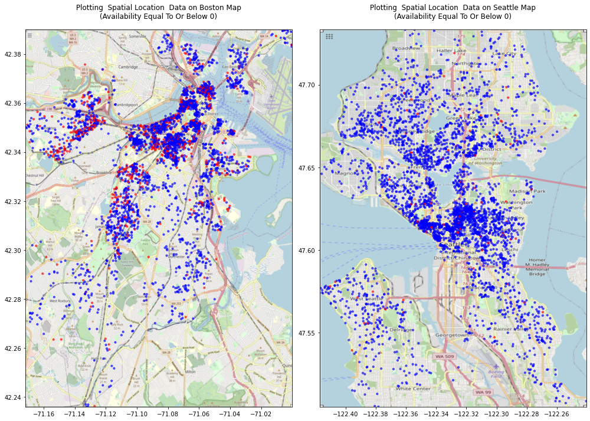
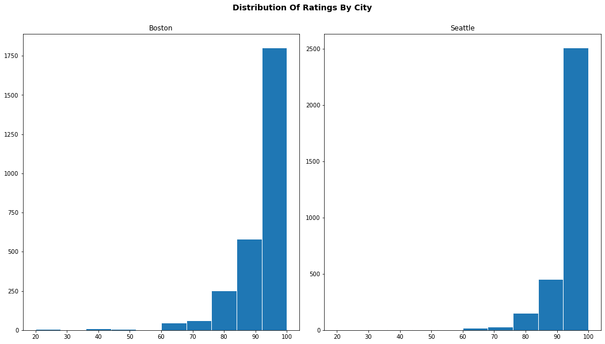
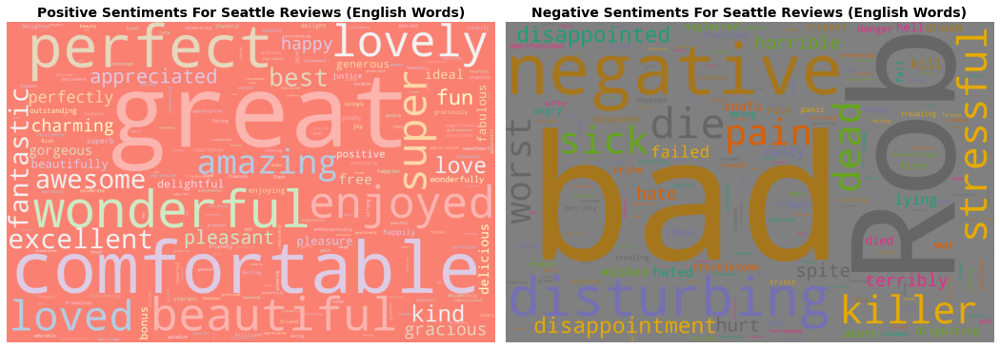
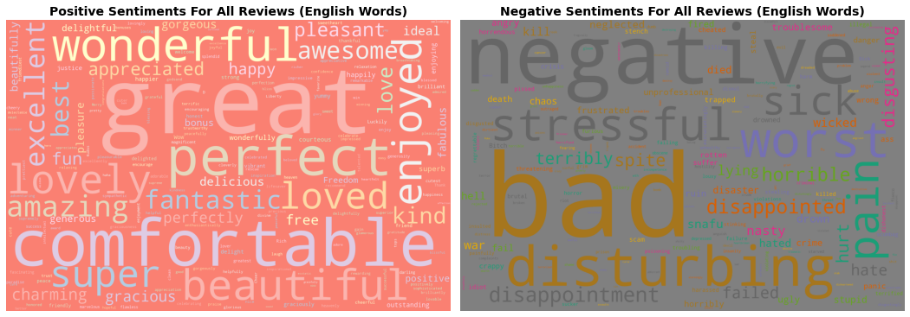

# AirBnB - A Sentiment Analysis

# Introduction

## [What is Airbnb and how does it work?](https://www.airbnb.com/help/article/2503/what-is-airbnb-and-how-does-it-work)
#### A community built on sharing
_"Airbnb began in 2008 when two designers who had space to share hosted three travelers looking for a place to stay. Now, millions of hosts and travelers choose to create a free Airbnb account so they can list their space and book unique accommodations anywhere in the world. And Airbnb experience hosts share their passions and interests with both travelers and locals."_

#### Trusted services
_"Airbnb helps make sharing easy, enjoyable, and safe. We verify personal profiles and listings, maintain a smart messaging system so hosts and guests can communicate with certainty, and manage a trusted platform to collect and transfer payments._"

## What Information Do We Have?
The source of the data is [kaggle.com](kaggle.com). The data used in this analysis is for two cities: [Boston](https://www.kaggle.com/airbnb/boston) and  [Seattle](https://www.kaggle.com/airbnb/seattle/data)

The data files are for _calendar_, _reviews_ and _listings_. The listings datafile contains one observation per listings, with information related to: Basic information (location, space, host, images (of listing and host), availability), Reviews, and Price. The calendar and reviews datafiles contain multiple entries per listing relating to individual availability data and reviews.

Where the data relates to  7403 unique listings.
The listings data contains information on those unique lists for 98 variables. The calendar data contains 8 
variables, with 2702460 observations (multiple observations per listing). And the reviews data contains 10 variables with
153124 observations

The earliest date included in the reviews data is 03-21-09 
and the lastest is 09-06-16 (and the relevant dates for listsings are 
01-04-16 
to 09-07-16)

There are 1383 listings that are not included in the reviews data. That is 18.68%.
This matches the missing reviews from the listings dataframe (i.e. where Number of Listings is zero): 1383

## Questions

For anyone new to AirBnB _(like me)_, the most obvious questions relate to:
- Locaton: If I want to avail of this service, what choices do I have in terms of location?
- Price: Compared to getting a hotel, is this service affordable?
- Reviews: What am I getting for the price that I pay? Is is a quality service?

# Location

There are 3585 unique listings in the Boston area, and 3818 unique listings in the Seattle area

We can plot the locations for AirBnB listings for both Boston and Seattle. Surprisingly _(for me)_ there are listings dotted around each city.

    

    

We can aggregate the listings by zip code, to get a better sense of how many listings there are:

    

    

## Availability

Even though there is a suprisingly disperse range of locations for each city, how often are those locations available?

The median availability, i.e. the median number of days of the year that the listing is available,
is 179.0 for Boston, and 308.0 for Seattle

The 75th percentile of availability, i.e. the number of days of the year that 75% or fewer of the listing are available,
is 325.0 for Boston, and 360.0 for Seattle

So, for Boston, the 50% of the listings are available for roughly half the year.Whereas for Seattle, at least 50% of the listings are available almost year round.

Here is the breakdown of availability by city:

    

    

As we can see, many of the listings are not available for any of the days in the sample. For Boston, the number of listings that are not
available for any days are 679 (i.e 18.9%), 
and for Seattle it is 95 (i.e 2.5%)
(for all listings combined, this is 774 (i.e. 10.5%))

    

    

    

    

Obviously, even accounting for availability, the range of locations available for both cities for most of the year (or almost all of the year in the case of Seattle) is suprising.

# Price

    

    

The breakdown of prices per zipcode for each city is:

    

    

Where the prices in red are for zip codes where the price is at or below the 25th percentile.
  
We see that, _very roughly_, the prices increase the closer to the city center the listing is (although this is not a hard and fast rule).

The median price is \$150.0 for Boston, and \$100.0 for Seattle (with the 1st percentile price being: \$31.0  and \$33.17,
and the 99th percentile price being \$600.0  and \$473.3, respectively)

So Boston is 50% more expensive than Seattle. Even then $150 can be viewed as reasonable (about what a _Udacity_ reviewer gets an hour ... for a full day's stay in a major US city).

This part would require further analysis, I have no information about the different zip codes in each city (and their hospitality to visitors). So I will leave this part of the analysis _(except to say that if you look at the ratings analysis below, grouped by by zip code, there is little correspondence between low prices and low ratings)_.

# Reviews & Ratings

## Overview of ratings

The datasets contain a wealth of information regarding reviews of listings. There are numeric assessments, accuracy of numeric assessments, and the actual comments by users, to list just a few variables relating to listing reviews.
  
We'll begin by looking at the ratings given by users, per city, aggregated by zip code:

    

    

As noted earlier, there is little correlation between the price of a listing and its rating. For each zip code the correlation is
0.13. Obviously, there could be aggregation bias, looking at the individual listing the correlation is:
0.05

This is one surprising feature of this analysis, you would think that all of the features that are attractive about a listing (location, ammenities, the quality of the listing) would be reflected in both the rating and the price. In this dataset, this is not the case.

    

    

    

    

## An overview of reviews

As we saw, the reviews are mostly positive. We are going analyze the reviews to see the sentiments expressed in the review. We are going use natural language process to scan each of the reviews for key _"sentiments"_ that are expressed in the reviews.

We will do this in three ways. 
- Firstly, we will naively just scan the reviews for sentiments.
- Once that is complete, we will review the results to see if they are consistent with the review ratings. We will use that information to update our analysis.
- Finally, we will will perform a review of our update and present our final analysis.

### Naive Examination

    

    

The results for the positive reviews are not too surprising, the results for the negative sentiments are shocking. 

Let's scan through some of the reviews to see where the words `die`, `rob`, `killer` and `war` appear. It turns out, we only need to look at the one example of each to see why those apparently shocking terms are used.

### Searching the comments for surprising terms

#### Die

Sean und seine Frau Clara sind sehr freundliche, aufmerksame und hilfsbereite Gastgeber. Sie bringen ihren Gästen großes Vertrauen entgegen. Schlafzimmer und Badezimmer waren gepflegt und großzügig. Als Mitbenutzer der Küche und des Wohnzimmers fühlten wir uns willkommen. Sean ist so freundlich, mein Fahrrad in seiner Garage aufzubewahren, solange ich durch Kanada reise. Ich kann diese Gastgeber nur weiter empfehlen. Uwe Gerischer

#### Killer

This airy studio had all the amenities and the most amazing view from the spacious patio. Walking distance to downtown and offering killer views this property was more than I could have hoped for. Our hostess was more than helpful and left everything a visitor could need, whether staying for one night or more. I cannot recommend this property highly enough!

#### Rob

We contacted Rob and he has great communication with us on the details of the place. We decided to book it. At the time of check-in, Rob came greet us and explained about the room. The room was very nice and clean as we expected. It is like what is in the pictures. We love the location of this room as it is close to everything such as highway and attractions. There are some coffee shops and grocery stores around the places. So far, we really enjoyed our stay.

#### War

Es war wundervoll bei Sean und seiner Familie. Das Zimmer ist perfekt von der Größe und wir haben uns sehr willkommen gefühlt. Es waren zwei sehr schöne Tage und wir hätten gern noch mehr Zeit gehabt. Wir konnten die Küche und das Wohnzimmer mitnutzen, alles ist sehr geräumig, hell und freundlich. Mit dem Bus kommt man gut in die Stadt, das Haus ist ruhig gelegen, so dass man gut schlafen kann.
Es wird sogar ein kleines Frühstück mit Kaffee oder Tee geboten, was man sich selbst zurecht machen kann. Sean und seine Frau sind sehr freundlich und offen, Gespräche kommen leicht zustande. Ich kann also diese Übernachtung nur empfehlen.
Für Auto-Reisende ist ein Parkplatz direkt vor der Tür.

So some of the reviews are not in english, and some of the _"sentiments"_ detected are due to colloquial usages. First, let's remove the non-english reviews.

### English Only Reviews

    

    

We no longer see _"war"_. However, surprisingly, _"die"_ remains and _"dead"_ becomes more prominent, but _"kller"_ (which is mainly english colloquial) doesn't. Unsurprisingly, _"rob"_ still remains. Let's see why _"die"_ is used.

### Searching the comments for surprising terms

Julie is a fantastic host. She greeted me warmly and answered all of my questions as I had them. What stands out for me is that she offered to get anything I needed for the mother-in-law unit (an extra trashcan, a microwave, blankets, etc.). She made sure that I was comfortable and felt welcomed. 

Something to be aware of is that the pictures are of a stock townhome from this complex but the place is nearly identical. As mentioned in previous reviews, there is no carpet in the bedroom. However, the bedroom and living room above it have its own separate climate control. Because of that, part of the floor is heated! 

Julie's home is clean with minimal decorations and a modern feel. The neighborhood is quiet and safe; it is within walking distance to bus stops and downtown. There's also lots of coffee shops, restaurants, and bars a few blocks away. It's a great, secure location. For nights in, the WiFi is incredibly fast and the bed is soft and very comfortable. The view from the roof is to die for. 

While Julie was often busy with work and her personal life, it was always a pleasure to speak with her at the end of the day. This is a great place and I highly recommend renting from her! 

Ok, more colloquial usage, what about _"killer"_?

This airy studio had all the amenities and the most amazing view from the spacious patio. Walking distance to downtown and offering killer views this property was more than I could have hoped for. Our hostess was more than helpful and left everything a visitor could need, whether staying for one night or more. I cannot recommend this property highly enough!

We contacted Rob and he has great communication with us on the details of the place. We decided to book it. At the time of check-in, Rob came greet us and explained about the room. The room was very nice and clean as we expected. It is like what is in the pictures. We love the location of this room as it is close to everything such as highway and attractions. There are some coffee shops and grocery stores around the places. So far, we really enjoyed our stay.

and finally, _"dead"_

I had an excellent time at Carol's place.  The room was everything I needed and the location was great.  I had rented a car and quickly found that parking in Seattle can be something of an ordeal, but Carol's house is located towards the end of a dead end street with so few houses on it that you'll always have a place to park for the night.  If you don't have a car, it's still totally possible to walk to some major hotspots, like the sports stadiums.  All in all I had a great time!

### Let's See if the colloquial usage is common across cities

    

    

    

    

### Adding Stopwords

The next step is to remove the words that are deemed to have a negative sentiment, but a used colloquially, or are actually names - That is, we will remove _die, dead, killer, and rob_:

    

    

The last step is to reflect the actual proportion of sentiments used. That is, we know that the ratings are excellent for most listings, so we would presume that the sentiments expressed in reviews would reflect this. So, let's make the area of each word cloud proportional to the sentitments found.

### Word Clouds Proportional To Sentiments Expressed

    

    

This final visualization highlights the disparity between the type of sentiments expressed. That is, every time a negative sentiment was expressed, on average, 77 positive sentiments were expressed

# Conclusion

As far back as 2016, when these datasets were compiled, _AirBnB_ was very active _(at least in the cities that we have data for)_.

We found some surprising results:
- The availability of listings on any given day differs dramatically between location
- The ratings are surprisingly positive, given the number of listings available. Obviously, they are not uniformly positive (I omitted an explicit analysis of some of the negative reviews).
- There is little correlation between the ratings and prices of the listings. This stands out as the most surprising conclusion for this dataset.

We found some entertaining results:
- A naive analysis of sentiments will be biased by _"Die Deutschen"_ (i.e. _"The Germans"_) and colloquial English usage.

Obviously, this is just _"the tip of the iceberg"_. For example, the price analysis would involve gathering information about amenities, listing rental unit size, and so on. But hopefully it was an enjoyable read!
