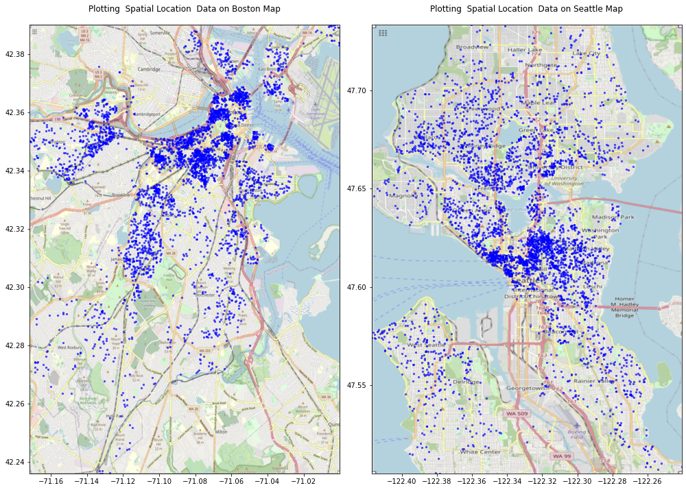
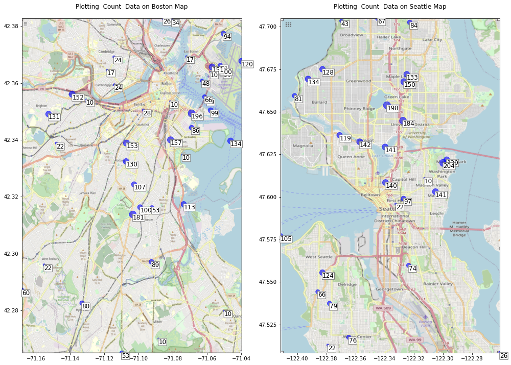
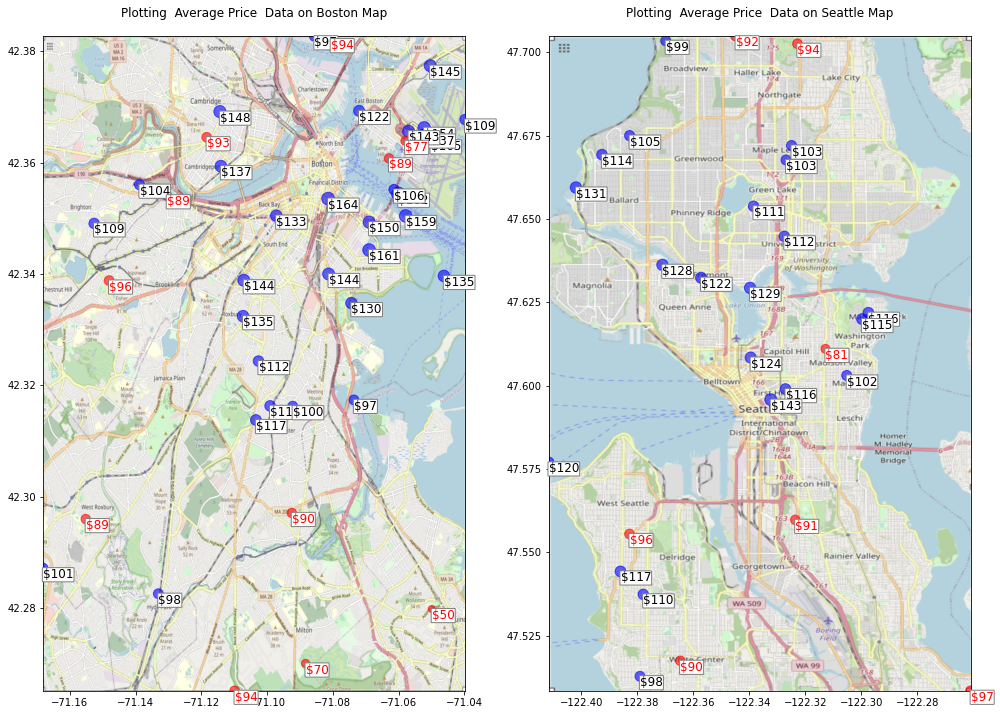
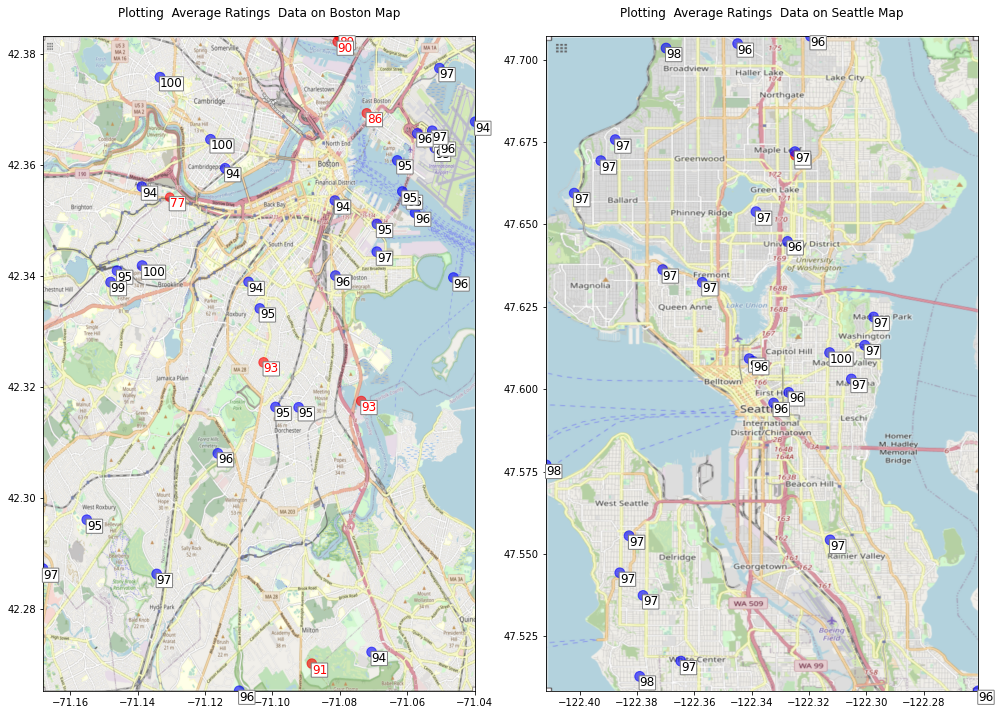
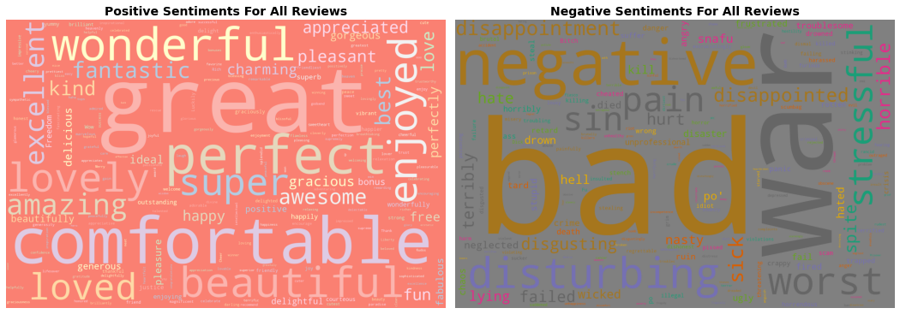
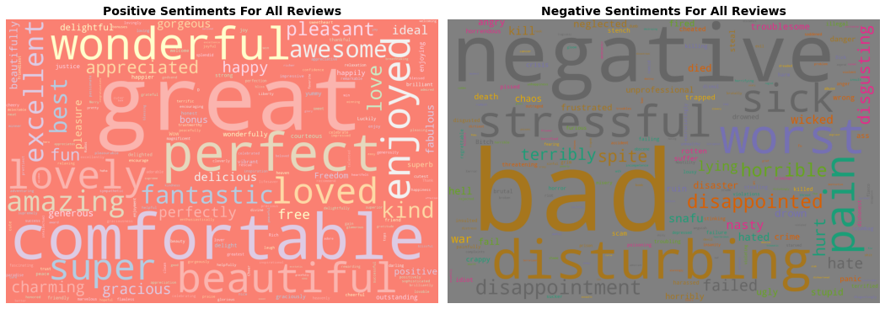
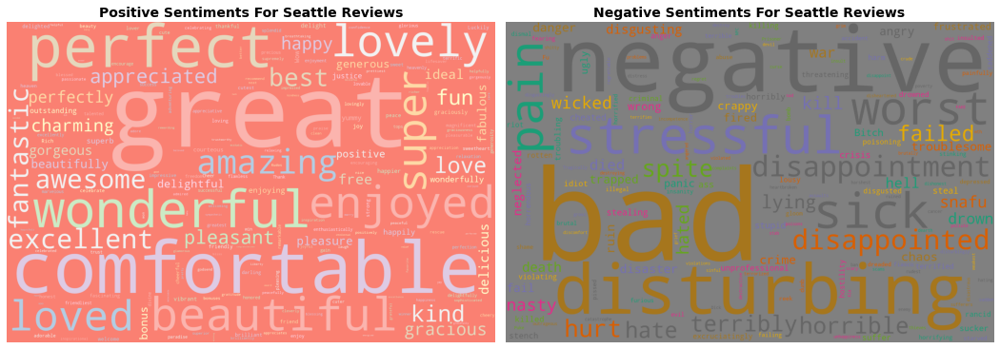
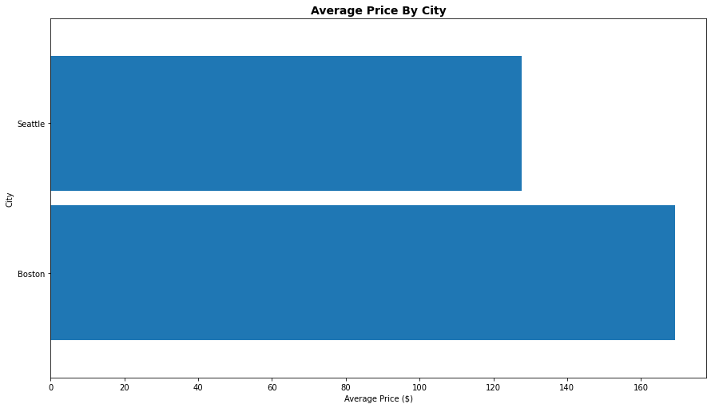
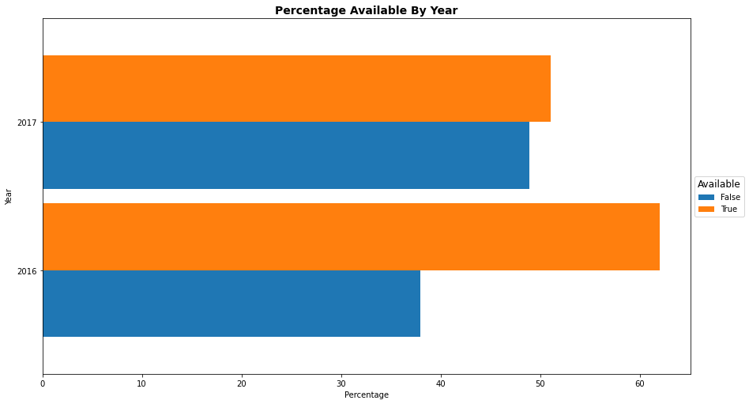

# AirBnB - A Sentiment Analysis

# Introduction

## [What is Airbnb and how does it work?](https://www.airbnb.com/help/article/2503/what-is-airbnb-and-how-does-it-work)
#### A community built on sharing
_"Airbnb began in 2008 when two designers who had space to share hosted three travelers looking for a place to stay. Now, millions of hosts and travelers choose to create a free Airbnb account so they can list their space and book unique accommodations anywhere in the world. And Airbnb experience hosts share their passions and interests with both travelers and locals."_

#### Trusted services
_"Airbnb helps make sharing easy, enjoyable, and safe. We verify personal profiles and listings, maintain a smart messaging system so hosts and guests can communicate with certainty, and manage a trusted platform to collect and transfer payments._"

## What Information Do We Have?
The source of the data is [kaggle.com](kaggle.com). The data used in this analysis is for two cities: [Boston](https://www.kaggle.com/airbnb/boston) and  [Seattle](https://www.kaggle.com/airbnb/seattle/data)

The data files are for _calendar_, _reviews_ and _listings_. The listings datafile contains one observation per listings, with information related to: Basic information (location, space, host, images (of listing and host), availability), Reviews, and Price. The calendar and reviews datafiles contain multiple entries per listing relating to individual availability data and reviews.

Where the data relates to  7403 unique listings, with observations and variables:  listings (7403, 95), calendar (2702460, 5), reviews (153124, 7)

## Questions

For anyone new to AirBnB _(like me)_, the most obvious questions relate to:
- Locaton: If I want to avail of this service, what choices do I have in terms of location?
- Price: Compared to getting a hotel, is this service affordable?
- Reviews: What am I getting for the price that I pay? Is is a quality service?

# Location

There are 3585 unique listings in the Boston area, and 3818 unique listings in the Seattle area

We can plot the locations for AirBnB listings for both Boston and Seattle. Surprisingly _(for me)_ there are listings dotted around each city.

    

    

The median availability, i.e. the median number of days of the year that the listing is available, is 179.0 for Boston, and 308.0 for Seattle

The 75th percentile of availability, i.e. the median number of days of the year that the listing is available, is 325.0 for Boston, and 360.0 for Seattle

So, for Boston, the 50% of the listings are available for roughly half the year.Whereas for Seattle, at least 50% of the listings are available almost year round.

    'Gloria Sanchez'

    

    

    

    

# Price

The median price is \$150.0 for Boston, and \$100.0 for Seattle (with the 1st percentile price being: \$31.0  and \$33.17,
and the 99th percentile price being \$600.0  and \$473.3, respectively)

The breakdown of prices per zipcode for each city is:

    

    

Where the prices in red are for zipcodes where the price is at or below the 25th percentile.

    

    

    

    

#### Is there information in the calendar or reviews data files that would be useful?

<table border="1" class="dataframe">
  <thead>
    <tr style="text-align: right;">
      <th></th>
      <th>listing_id</th>
      <th>date</th>
      <th>available</th>
      <th>price</th>
      <th>city</th>
    </tr>
  </thead>
  <tbody>
    <tr>
      <th>1473187</th>
      <td>10274175</td>
      <td>2016-02-20</td>
      <td>t</td>
      <td>$46.00</td>
      <td>Seattle</td>
    </tr>
    <tr>
      <th>1476002</th>
      <td>8193332</td>
      <td>2016-11-06</td>
      <td>t</td>
      <td>$100.00</td>
      <td>Seattle</td>
    </tr>
    <tr>
      <th>1330041</th>
      <td>3269390</td>
      <td>2016-12-15</td>
      <td>t</td>
      <td>$95.00</td>
      <td>Seattle</td>
    </tr>
    <tr>
      <th>2112622</th>
      <td>7713043</td>
      <td>2016-01-06</td>
      <td>t</td>
      <td>$75.00</td>
      <td>Seattle</td>
    </tr>
    <tr>
      <th>23788</th>
      <td>12806707</td>
      <td>2017-07-04</td>
      <td>t</td>
      <td>$60.00</td>
      <td>Boston</td>
    </tr>
  </tbody>
</table>

<table border="1" class="dataframe">
  <thead>
    <tr style="text-align: right;">
      <th></th>
      <th>listing_id</th>
      <th>id</th>
      <th>date</th>
      <th>reviewer_id</th>
      <th>reviewer_name</th>
      <th>comments</th>
      <th>city</th>
    </tr>
  </thead>
  <tbody>
    <tr>
      <th>43699</th>
      <td>2746782</td>
      <td>38121292</td>
      <td>2015-07-13</td>
      <td>28180522</td>
      <td>Anita</td>
      <td>We checked in very late on Friday and since we approached from the street above the property, walking down the stairway, we had to disturb Jean-Marc to make sure we had the right place. He was very gracious and welcoming.\r\n\r\nThis unit was very clean, and just as pictured. The location is quiet and private, and since we came back rather late at night, we were happy not to disturb anyone. The bed was very comfortable and was appreciated after our busy days in Seattle. Great coffee with the Keurig, and the refrigerator and microwave would have been used, but we were hardly there!</td>
      <td>Seattle</td>
    </tr>
    <tr>
      <th>134473</th>
      <td>8523157</td>
      <td>83104785</td>
      <td>2016-07-01</td>
      <td>75099287</td>
      <td>Jon</td>
      <td>The hosts were great. They  provided outstanding communication before and during the trip. They offered suggestions about where to go and where to eat. The accommodations provided were immaculate and spacious. WARNING: you will fall in love with the cat and dogs. I returned two additional times due to the pets and hospitality. Thanks!</td>
      <td>Boston</td>
    </tr>
    <tr>
      <th>14338</th>
      <td>1796302</td>
      <td>10641558</td>
      <td>2014-03-01</td>
      <td>11918488</td>
      <td>Meredith</td>
      <td>Susanna was a fantastic hostess during my recent stay. She was accessible and accommodating, and I felt welcome from the moment we first communicated. Her home is lovely, her pets are sweet, and her local knowledge is impressive. She provided expert guidance on everything from restaurants to city-wide transit, and she made sure my friend and I had everything we needed at all times. I'll certainly plan my next trip to Seattle around Susanna's availability. I can't imagine staying anywhere else!</td>
      <td>Seattle</td>
    </tr>
    <tr>
      <th>89471</th>
      <td>3601424</td>
      <td>32554893</td>
      <td>2015-05-19</td>
      <td>21341343</td>
      <td>Crystal</td>
      <td>Erin was an extremely gracious host.  The room was spacious and had plenty of storage for all of our luggage and clothing.  We weren't at the home much, but we're thankful that we could come in after a long day and get straight to rest!  Room was comfy and the house was clean!</td>
      <td>Boston</td>
    </tr>
    <tr>
      <th>62799</th>
      <td>7305969</td>
      <td>53210004</td>
      <td>2015-11-06</td>
      <td>11489767</td>
      <td>Amy</td>
      <td>Emily was a great hostess and made me feel right at home with anything I needed and great recommendations.</td>
      <td>Seattle</td>
    </tr>
  </tbody>
</table>

# Reviews

To create all of the required pickle files took 1835.31 seconds, or 30.59 minutes

We have seen that the reviews are mostly positive. We are going analyze the reviews to see the sentiments expressed in the review. We are going use natural language process to scan each of the reviews for key _"sentiments"_ that are expressed in the reviews.

We will do this in three ways. 
- Firstly, we will naively just scan the reviews for sentiments.
- Once that is complete, we will review the results to see if they are consistent with the review ratings. We will use that information to update our analysis.
- Finally, we will will perform a review of our update and present our final analysis.

## Naive Examination

    

    

The results for the positive reviews are not too surprising, the results for the negative sentiments are shocking. 

Let's scan through some of the reviews to see where the words `die`, `rob`, `killer` and `war` appear. It turns out, we only need to look at the one example of each to see why those apparently shocking terms are used.

#### Die

Sean und seine Frau Clara sind sehr freundliche, aufmerksame und hilfsbereite Gastgeber. Sie bringen ihren Gästen großes Vertrauen entgegen. Schlafzimmer und Badezimmer waren gepflegt und großzügig. Als Mitbenutzer der Küche und des Wohnzimmers fühlten wir uns willkommen. Sean ist so freundlich, mein Fahrrad in seiner Garage aufzubewahren, solange ich durch Kanada reise. Ich kann diese Gastgeber nur weiter empfehlen. Uwe Gerischer

#### Killer

This airy studio had all the amenities and the most amazing view from the spacious patio. Walking distance to downtown and offering killer views this property was more than I could have hoped for. Our hostess was more than helpful and left everything a visitor could need, whether staying for one night or more. I cannot recommend this property highly enough!

#### Rob

We contacted Rob and he has great communication with us on the details of the place. We decided to book it. At the time of check-in, Rob came greet us and explained about the room. The room was very nice and clean as we expected. It is like what is in the pictures. We love the location of this room as it is close to everything such as highway and attractions. There are some coffee shops and grocery stores around the places. So far, we really enjoyed our stay.

So some of the reviews are not in english, and some of the _"sentiments"_ detected are due to colloquial usages. First, let's remove the non-english reviews.

## English Only Reviews

    

    

Surprisingly, _"die"_ remains, but _"kller"_ (which is mainly english colloquial) doesn't. Unsurprisingly, _"rob"_ still remains. Let's see why _"die"_ is used.

Julie is a fantastic host. She greeted me warmly and answered all of my questions as I had them. What stands out for me is that she offered to get anything I needed for the mother-in-law unit (an extra trashcan, a microwave, blankets, etc.). She made sure that I was comfortable and felt welcomed. 

Something to be aware of is that the pictures are of a stock townhome from this complex but the place is nearly identical. As mentioned in previous reviews, there is no carpet in the bedroom. However, the bedroom and living room above it have its own separate climate control. Because of that, part of the floor is heated! 

Julie's home is clean with minimal decorations and a modern feel. The neighborhood is quiet and safe; it is within walking distance to bus stops and downtown. There's also lots of coffee shops, restaurants, and bars a few blocks away. It's a great, secure location. For nights in, the WiFi is incredibly fast and the bed is soft and very comfortable. The view from the roof is to die for. 

While Julie was often busy with work and her personal life, it was always a pleasure to speak with her at the end of the day. This is a great place and I highly recommend renting from her! 

Ok, more colloquial usage, what about _"killer"_?

This airy studio had all the amenities and the most amazing view from the spacious patio. Walking distance to downtown and offering killer views this property was more than I could have hoped for. Our hostess was more than helpful and left everything a visitor could need, whether staying for one night or more. I cannot recommend this property highly enough!

We contacted Rob and he has great communication with us on the details of the place. We decided to book it. At the time of check-in, Rob came greet us and explained about the room. The room was very nice and clean as we expected. It is like what is in the pictures. We love the location of this room as it is close to everything such as highway and attractions. There are some coffee shops and grocery stores around the places. So far, we really enjoyed our stay.

    

    

    

    

I had an excellent time at Carol's place.  The room was everything I needed and the location was great.  I had rented a car and quickly found that parking in Seattle can be something of an ordeal, but Carol's house is located towards the end of a dead end street with so few houses on it that you'll always have a place to park for the night.  If you don't have a car, it's still totally possible to walk to some major hotspots, like the sports stadiums.  All in all I had a great time!

    

    

#### Word Clouds Proportional To Sentiments Expressed

    

    

#### Time Taken
        Grouped by city, english language only: Time Taken: 303.38720989227295 seconds
                            loaded from pickle: Time Taken: 15.748566150665283 seconds

<h2>Decision About Merging</h2)

    None

#### Do the dataframes include the same listings?

    []

    []

    []

There are 1383 listings that are not included in the reviews dataframe. That is 18.68%.
This matches the missing reviews from the listings dataframe (i.e. where Number of Listings is zero): 1383

All listings, in the listings data, are in the calendar data file. But close to 19% are missing from the reviews data.

    ['number_of_reviews',
     'first_review',
     'last_review',
     'review_scores_rating',
     'review_scores_accuracy',
     'review_scores_cleanliness',
     'review_scores_checkin',
     'review_scores_communication',
     'review_scores_location',
     'review_scores_value',
     'reviews_per_month',
     'Review Scores Rating Percentiles']

    1383

    

    

    count   7403.00
    mean     147.80
    std      102.89
    min        0.00
    0%         0.00
    10%       55.00
    20%       70.00
    30%       85.00
    40%      100.00
    50%      120.00
    60%      145.00
    70%      170.00
    80%      200.00
    90%      275.00
    100%     999.00
    max      999.00
    Name: price, dtype: float64

    

    

    

    

    

    

              city_merge
              Boston    127.976
              Seattle   173.926
              Name: price, dtype: float64

<table border="1" class="dataframe">
  <thead>
    <tr style="text-align: right;">
      <th></th>
      <th>count</th>
      <th>mean</th>
      <th>std</th>
      <th>min</th>
      <th>25%</th>
      <th>50%</th>
      <th>75%</th>
      <th>max</th>
    </tr>
  </thead>
  <tbody>
    <tr>
      <th>listing_id</th>
      <td>2702460.00</td>
      <td>6950804.94</td>
      <td>4052439.85</td>
      <td>3335.00</td>
      <td>3865312.75</td>
      <td>7035369.00</td>
      <td>9504211.25</td>
      <td>14933461.00</td>
    </tr>
    <tr>
      <th>price</th>
      <td>1577579.00</td>
      <td>162.60</td>
      <td>143.70</td>
      <td>10.00</td>
      <td>79.00</td>
      <td>120.00</td>
      <td>200.00</td>
      <td>7163.00</td>
    </tr>
    <tr>
      <th>year</th>
      <td>2702460.00</td>
      <td>2016.33</td>
      <td>0.47</td>
      <td>2016.00</td>
      <td>2016.00</td>
      <td>2016.00</td>
      <td>2017.00</td>
      <td>2017.00</td>
    </tr>
  </tbody>
</table>

<table border="1" class="dataframe">
  <thead>
    <tr style="text-align: right;">
      <th></th>
      <th>count</th>
      <th>mean</th>
      <th>std</th>
      <th>min</th>
      <th>25%</th>
      <th>50%</th>
      <th>75%</th>
      <th>max</th>
    </tr>
  </thead>
  <tbody>
    <tr>
      <th>id</th>
      <td>7403.00</td>
      <td>6950001.48</td>
      <td>4052396.78</td>
      <td>3335.00</td>
      <td>3864099.50</td>
      <td>7035240.00</td>
      <td>9500804.00</td>
      <td>14933461.00</td>
    </tr>
    <tr>
      <th>scrape_id</th>
      <td>7403.00</td>
      <td>20160492479532.68</td>
      <td>400929617.51</td>
      <td>20160104002432.00</td>
      <td>20160104002432.00</td>
      <td>20160104002432.00</td>
      <td>20160906204935.00</td>
      <td>20160906204935.00</td>
    </tr>
    <tr>
      <th>host_id</th>
      <td>7403.00</td>
      <td>20210534.87</td>
      <td>19623093.35</td>
      <td>4193.00</td>
      <td>4343163.50</td>
      <td>14486505.00</td>
      <td>30283594.00</td>
      <td>93854106.00</td>
    </tr>
    <tr>
      <th>host_listings_count</th>
      <td>7401.00</td>
      <td>32.22</td>
      <td>123.59</td>
      <td>0.00</td>
      <td>1.00</td>
      <td>1.00</td>
      <td>4.00</td>
      <td>749.00</td>
    </tr>
    <tr>
      <th>host_total_listings_count</th>
      <td>7401.00</td>
      <td>32.22</td>
      <td>123.59</td>
      <td>0.00</td>
      <td>1.00</td>
      <td>1.00</td>
      <td>4.00</td>
      <td>749.00</td>
    </tr>
    <tr>
      <th>latitude</th>
      <td>7403.00</td>
      <td>45.07</td>
      <td>2.64</td>
      <td>42.24</td>
      <td>42.35</td>
      <td>47.54</td>
      <td>47.62</td>
      <td>47.73</td>
    </tr>
    <tr>
      <th>longitude</th>
      <td>7403.00</td>
      <td>-97.52</td>
      <td>25.61</td>
      <td>-122.42</td>
      <td>-122.33</td>
      <td>-122.28</td>
      <td>-71.08</td>
      <td>-71.00</td>
    </tr>
    <tr>
      <th>accommodates</th>
      <td>7403.00</td>
      <td>3.20</td>
      <td>1.89</td>
      <td>1.00</td>
      <td>2.00</td>
      <td>2.00</td>
      <td>4.00</td>
      <td>16.00</td>
    </tr>
    <tr>
      <th>bathrooms</th>
      <td>7373.00</td>
      <td>1.24</td>
      <td>0.55</td>
      <td>0.00</td>
      <td>1.00</td>
      <td>1.00</td>
      <td>1.00</td>
      <td>8.00</td>
    </tr>
    <tr>
      <th>bedrooms</th>
      <td>7387.00</td>
      <td>1.28</td>
      <td>0.82</td>
      <td>0.00</td>
      <td>1.00</td>
      <td>1.00</td>
      <td>2.00</td>
      <td>7.00</td>
    </tr>
    <tr>
      <th>beds</th>
      <td>7393.00</td>
      <td>1.67</td>
      <td>1.08</td>
      <td>0.00</td>
      <td>1.00</td>
      <td>1.00</td>
      <td>2.00</td>
      <td>16.00</td>
    </tr>
    <tr>
      <th>square_feet</th>
      <td>153.00</td>
      <td>856.03</td>
      <td>647.19</td>
      <td>0.00</td>
      <td>420.00</td>
      <td>770.00</td>
      <td>1200.00</td>
      <td>3000.00</td>
    </tr>
    <tr>
      <th>price</th>
      <td>7403.00</td>
      <td>147.80</td>
      <td>102.89</td>
      <td>0.00</td>
      <td>79.00</td>
      <td>120.00</td>
      <td>189.00</td>
      <td>999.00</td>
    </tr>
    <tr>
      <th>guests_included</th>
      <td>7403.00</td>
      <td>1.56</td>
      <td>1.20</td>
      <td>0.00</td>
      <td>1.00</td>
      <td>1.00</td>
      <td>2.00</td>
      <td>15.00</td>
    </tr>
    <tr>
      <th>minimum_nights</th>
      <td>7403.00</td>
      <td>2.76</td>
      <td>13.24</td>
      <td>1.00</td>
      <td>1.00</td>
      <td>2.00</td>
      <td>3.00</td>
      <td>1000.00</td>
    </tr>
    <tr>
      <th>maximum_nights</th>
      <td>7403.00</td>
      <td>14313.37</td>
      <td>1162232.13</td>
      <td>1.00</td>
      <td>95.50</td>
      <td>1125.00</td>
      <td>1125.00</td>
      <td>99999999.00</td>
    </tr>
    <tr>
      <th>availability_30</th>
      <td>7403.00</td>
      <td>12.85</td>
      <td>12.07</td>
      <td>0.00</td>
      <td>0.00</td>
      <td>10.00</td>
      <td>26.00</td>
      <td>30.00</td>
    </tr>
    <tr>
      <th>availability_60</th>
      <td>7403.00</td>
      <td>29.56</td>
      <td>23.84</td>
      <td>0.00</td>
      <td>1.00</td>
      <td>31.00</td>
      <td>55.00</td>
      <td>60.00</td>
    </tr>
    <tr>
      <th>availability_90</th>
      <td>7403.00</td>
      <td>48.63</td>
      <td>35.01</td>
      <td>0.00</td>
      <td>7.00</td>
      <td>56.00</td>
      <td>84.00</td>
      <td>90.00</td>
    </tr>
    <tr>
      <th>availability_365</th>
      <td>7403.00</td>
      <td>213.09</td>
      <td>138.34</td>
      <td>0.00</td>
      <td>77.00</td>
      <td>259.00</td>
      <td>347.00</td>
      <td>365.00</td>
    </tr>
    <tr>
      <th>number_of_reviews</th>
      <td>7403.00</td>
      <td>20.68</td>
      <td>36.73</td>
      <td>0.00</td>
      <td>1.00</td>
      <td>7.00</td>
      <td>23.00</td>
      <td>474.00</td>
    </tr>
    <tr>
      <th>review_scores_rating</th>
      <td>5943.00</td>
      <td>93.32</td>
      <td>8.21</td>
      <td>20.00</td>
      <td>91.00</td>
      <td>96.00</td>
      <td>99.00</td>
      <td>100.00</td>
    </tr>
    <tr>
      <th>review_scores_accuracy</th>
      <td>5922.00</td>
      <td>9.54</td>
      <td>0.82</td>
      <td>2.00</td>
      <td>9.00</td>
      <td>10.00</td>
      <td>10.00</td>
      <td>10.00</td>
    </tr>
    <tr>
      <th>review_scores_cleanliness</th>
      <td>5932.00</td>
      <td>9.42</td>
      <td>1.00</td>
      <td>2.00</td>
      <td>9.00</td>
      <td>10.00</td>
      <td>10.00</td>
      <td>10.00</td>
    </tr>
    <tr>
      <th>review_scores_checkin</th>
      <td>5925.00</td>
      <td>9.72</td>
      <td>0.68</td>
      <td>2.00</td>
      <td>10.00</td>
      <td>10.00</td>
      <td>10.00</td>
      <td>10.00</td>
    </tr>
    <tr>
      <th>review_scores_communication</th>
      <td>5934.00</td>
      <td>9.73</td>
      <td>0.66</td>
      <td>2.00</td>
      <td>10.00</td>
      <td>10.00</td>
      <td>10.00</td>
      <td>10.00</td>
    </tr>
    <tr>
      <th>review_scores_location</th>
      <td>5926.00</td>
      <td>9.52</td>
      <td>0.78</td>
      <td>2.00</td>
      <td>9.00</td>
      <td>10.00</td>
      <td>10.00</td>
      <td>10.00</td>
    </tr>
    <tr>
      <th>review_scores_value</th>
      <td>5926.00</td>
      <td>9.32</td>
      <td>0.89</td>
      <td>2.00</td>
      <td>9.00</td>
      <td>9.00</td>
      <td>10.00</td>
      <td>10.00</td>
    </tr>
    <tr>
      <th>license</th>
      <td>0.00</td>
      <td>NaN</td>
      <td>NaN</td>
      <td>NaN</td>
      <td>NaN</td>
      <td>NaN</td>
      <td>NaN</td>
      <td>NaN</td>
    </tr>
    <tr>
      <th>calculated_host_listings_count</th>
      <td>7403.00</td>
      <td>7.69</td>
      <td>21.47</td>
      <td>1.00</td>
      <td>1.00</td>
      <td>1.00</td>
      <td>3.00</td>
      <td>136.00</td>
    </tr>
    <tr>
      <th>reviews_per_month</th>
      <td>6020.00</td>
      <td>2.03</td>
      <td>1.97</td>
      <td>0.01</td>
      <td>0.59</td>
      <td>1.37</td>
      <td>2.89</td>
      <td>19.15</td>
    </tr>
    <tr>
      <th>year</th>
      <td>7403.00</td>
      <td>2016.00</td>
      <td>0.00</td>
      <td>2016.00</td>
      <td>2016.00</td>
      <td>2016.00</td>
      <td>2016.00</td>
      <td>2016.00</td>
    </tr>
  </tbody>
</table>

<table border="1" class="dataframe">
  <thead>
    <tr style="text-align: right;">
      <th></th>
      <th>count</th>
      <th>mean</th>
      <th>std</th>
      <th>min</th>
      <th>25%</th>
      <th>50%</th>
      <th>75%</th>
      <th>max</th>
    </tr>
  </thead>
  <tbody>
    <tr>
      <th>listing_id</th>
      <td>153124.00</td>
      <td>3787517.47</td>
      <td>3248161.22</td>
      <td>3353.00</td>
      <td>1071843.00</td>
      <td>3139972.00</td>
      <td>5958674.00</td>
      <td>14843783.00</td>
    </tr>
    <tr>
      <th>id</th>
      <td>153124.00</td>
      <td>40342403.39</td>
      <td>24778966.56</td>
      <td>1021.00</td>
      <td>20620259.75</td>
      <td>38463998.00</td>
      <td>53978187.50</td>
      <td>99990454.00</td>
    </tr>
    <tr>
      <th>reviewer_id</th>
      <td>153124.00</td>
      <td>21922545.05</td>
      <td>18816034.68</td>
      <td>15.00</td>
      <td>6342335.75</td>
      <td>17552614.00</td>
      <td>32977175.50</td>
      <td>93350341.00</td>
    </tr>
    <tr>
      <th>year</th>
      <td>153124.00</td>
      <td>2014.72</td>
      <td>1.06</td>
      <td>2009.00</td>
      <td>2014.00</td>
      <td>2015.00</td>
      <td>2015.00</td>
      <td>2016.00</td>
    </tr>
  </tbody>
</table>

<table border="1" class="dataframe">
  <thead>
    <tr style="text-align: right;">
      <th></th>
      <th>0</th>
    </tr>
  </thead>
  <tbody>
    <tr>
      <th>id</th>
      <td>12147973</td>
    </tr>
    <tr>
      <th>listing_url</th>
      <td>https://www.airbnb.com/rooms/12147973</td>
    </tr>
    <tr>
      <th>scrape_id</th>
      <td>20160906204935</td>
    </tr>
    <tr>
      <th>last_scraped</th>
      <td>2016-09-07 00:00:00</td>
    </tr>
    <tr>
      <th>name</th>
      <td>Sunny Bungalow in the City</td>
    </tr>
    <tr>
      <th>summary</th>
      <td>Cozy, sunny, family home.  Master bedroom high ceilings. Deck, garden with hens, beehives &amp; play structure.   Short walk to charming village with  attractive stores, groceries &amp; local restaurants. Friendly neighborhood. Access public transportation.</td>
    </tr>
    <tr>
      <th>space</th>
      <td>The house has an open and cozy feel at the same time.  The living room has a flat screen TV.  The kitchen has all you need for cooking.  We prefer you buy your food but can use the organic oils, herbs, etc.   The yard can be seen from sitting room and when the weather allows, the yard is a place children can lose themselves in a safe way.  We have 2 bee hives, 6 hens fenced in (sometimes they get out of their coop area &amp; into the yard), 2 rabbits in a hutch and play structure.</td>
    </tr>
    <tr>
      <th>description</th>
      <td>Cozy, sunny, family home.  Master bedroom high ceilings. Deck, garden with hens, beehives &amp; play structure.   Short walk to charming village with  attractive stores, groceries &amp; local restaurants. Friendly neighborhood. Access public transportation. The house has an open and cozy feel at the same time.  The living room has a flat screen TV.  The kitchen has all you need for cooking.  We prefer you buy your food but can use the organic oils, herbs, etc.   The yard can be seen from sitting room and when the weather allows, the yard is a place children can lose themselves in a safe way.  We have 2 bee hives, 6 hens fenced in (sometimes they get out of their coop area &amp; into the yard), 2 rabbits in a hutch and play structure. You will have access to 2 bedrooms, a living room, kitchen, bathrooms, and yard. Roslindale is quiet, convenient and friendly.  For Southern food try Redd's in Rozzie.  Italian Delfino's or Sophia's Grotto are great. Birch St Bistro has nice atmostphere--a little pric</td>
    </tr>
    <tr>
      <th>experiences_offered</th>
      <td>none</td>
    </tr>
    <tr>
      <th>neighborhood_overview</th>
      <td>Roslindale is quiet, convenient and friendly.  For Southern food try Redd's in Rozzie.  Italian Delfino's or Sophia's Grotto are great. Birch St Bistro has nice atmostphere--a little pricier.   If you are cooking the Fish Market has fresh fish daily; Tony's makes his own sausages and has Italian foods;  for  a wide variety of delicious cheeses and chocolates go to the Cheese Cellar on Birch St.</td>
    </tr>
    <tr>
      <th>notes</th>
      <td>NaN</td>
    </tr>
    <tr>
      <th>transit</th>
      <td>The bus stop is 2 blocks away, and frequent. Bus is about a 10 minute ride to the Orange line, forest hills. The commuter rail into down town is a 6 minute walk from our home.  Walking is pleasant and restaurants, shops and grocery store are all a 6 minute walk away.</td>
    </tr>
    <tr>
      <th>access</th>
      <td>You will have access to 2 bedrooms, a living room, kitchen, bathrooms, and yard.</td>
    </tr>
    <tr>
      <th>interaction</th>
      <td>NaN</td>
    </tr>
    <tr>
      <th>house_rules</th>
      <td>Clean up and treat the home the way you'd like your home to be treated.  No smoking.</td>
    </tr>
    <tr>
      <th>thumbnail_url</th>
      <td>https://a2.muscache.com/im/pictures/c0842db1-ee98-4fe8-870b-d1e2af33855d.jpg?aki_policy=small</td>
    </tr>
    <tr>
      <th>medium_url</th>
      <td>https://a2.muscache.com/im/pictures/c0842db1-ee98-4fe8-870b-d1e2af33855d.jpg?aki_policy=medium</td>
    </tr>
    <tr>
      <th>picture_url</th>
      <td>https://a2.muscache.com/im/pictures/c0842db1-ee98-4fe8-870b-d1e2af33855d.jpg?aki_policy=large</td>
    </tr>
    <tr>
      <th>xl_picture_url</th>
      <td>https://a2.muscache.com/im/pictures/c0842db1-ee98-4fe8-870b-d1e2af33855d.jpg?aki_policy=x_large</td>
    </tr>
    <tr>
      <th>host_id</th>
      <td>31303940</td>
    </tr>
    <tr>
      <th>host_url</th>
      <td>https://www.airbnb.com/users/show/31303940</td>
    </tr>
    <tr>
      <th>host_name</th>
      <td>Virginia</td>
    </tr>
    <tr>
      <th>host_since</th>
      <td>2015-04-15</td>
    </tr>
    <tr>
      <th>host_location</th>
      <td>Boston, Massachusetts, United States</td>
    </tr>
    <tr>
      <th>host_about</th>
      <td>We are country and city connecting in our deck and garden. Enjoy our music room, books and flat screen TV with the pastoral backyard of hens, bees, rabbits and an organic garden.</td>
    </tr>
    <tr>
      <th>host_response_time</th>
      <td>NaN</td>
    </tr>
    <tr>
      <th>host_response_rate</th>
      <td>NaN</td>
    </tr>
    <tr>
      <th>host_acceptance_rate</th>
      <td>NaN</td>
    </tr>
    <tr>
      <th>host_is_superhost</th>
      <td>f</td>
    </tr>
    <tr>
      <th>host_thumbnail_url</th>
      <td>https://a2.muscache.com/im/pictures/5936fef0-ba16-45bd-ac33-9226137d0763.jpg?aki_policy=profile_small</td>
    </tr>
    <tr>
      <th>host_picture_url</th>
      <td>https://a2.muscache.com/im/pictures/5936fef0-ba16-45bd-ac33-9226137d0763.jpg?aki_policy=profile_x_medium</td>
    </tr>
    <tr>
      <th>host_neighbourhood</th>
      <td>Roslindale</td>
    </tr>
    <tr>
      <th>host_listings_count</th>
      <td>1.0</td>
    </tr>
    <tr>
      <th>host_total_listings_count</th>
      <td>1.0</td>
    </tr>
    <tr>
      <th>host_verifications</th>
      <td>['email', 'phone', 'facebook', 'reviews']</td>
    </tr>
    <tr>
      <th>host_has_profile_pic</th>
      <td>t</td>
    </tr>
    <tr>
      <th>host_identity_verified</th>
      <td>f</td>
    </tr>
    <tr>
      <th>street</th>
      <td>Birch Street, Boston, MA 02131, United States</td>
    </tr>
    <tr>
      <th>neighbourhood</th>
      <td>Roslindale</td>
    </tr>
    <tr>
      <th>neighbourhood_cleansed</th>
      <td>Roslindale</td>
    </tr>
    <tr>
      <th>neighbourhood_group_cleansed</th>
      <td>NaN</td>
    </tr>
    <tr>
      <th>city</th>
      <td>Boston</td>
    </tr>
    <tr>
      <th>state</th>
      <td>MA</td>
    </tr>
    <tr>
      <th>zipcode</th>
      <td>02131</td>
    </tr>
    <tr>
      <th>market</th>
      <td>Boston</td>
    </tr>
    <tr>
      <th>smart_location</th>
      <td>Boston, MA</td>
    </tr>
    <tr>
      <th>country_code</th>
      <td>US</td>
    </tr>
    <tr>
      <th>country</th>
      <td>United States</td>
    </tr>
    <tr>
      <th>latitude</th>
      <td>42.28</td>
    </tr>
    <tr>
      <th>longitude</th>
      <td>-71.13</td>
    </tr>
    <tr>
      <th>is_location_exact</th>
      <td>t</td>
    </tr>
    <tr>
      <th>property_type</th>
      <td>House</td>
    </tr>
    <tr>
      <th>room_type</th>
      <td>Entire home/apt</td>
    </tr>
    <tr>
      <th>accommodates</th>
      <td>4</td>
    </tr>
    <tr>
      <th>bathrooms</th>
      <td>1.5</td>
    </tr>
    <tr>
      <th>bedrooms</th>
      <td>2.0</td>
    </tr>
    <tr>
      <th>beds</th>
      <td>3.0</td>
    </tr>
    <tr>
      <th>bed_type</th>
      <td>Real Bed</td>
    </tr>
    <tr>
      <th>amenities</th>
      <td>{TV,"Wireless Internet",Kitchen,"Free Parking on Premises","Pets live on this property",Dog(s),Heating,"Family/Kid Friendly",Washer,Dryer,"Smoke Detector","Fire Extinguisher",Essentials,Shampoo,"Laptop Friendly Workspace"}</td>
    </tr>
    <tr>
      <th>square_feet</th>
      <td>NaN</td>
    </tr>
    <tr>
      <th>price</th>
      <td>250.0</td>
    </tr>
    <tr>
      <th>weekly_price</th>
      <td>NaN</td>
    </tr>
    <tr>
      <th>monthly_price</th>
      <td>NaN</td>
    </tr>
    <tr>
      <th>security_deposit</th>
      <td>NaN</td>
    </tr>
    <tr>
      <th>cleaning_fee</th>
      <td>$35.00</td>
    </tr>
    <tr>
      <th>guests_included</th>
      <td>1</td>
    </tr>
    <tr>
      <th>extra_people</th>
      <td>$0.00</td>
    </tr>
    <tr>
      <th>minimum_nights</th>
      <td>2</td>
    </tr>
    <tr>
      <th>maximum_nights</th>
      <td>1125</td>
    </tr>
    <tr>
      <th>calendar_updated</th>
      <td>2 weeks ago</td>
    </tr>
    <tr>
      <th>has_availability</th>
      <td>NaN</td>
    </tr>
    <tr>
      <th>availability_30</th>
      <td>0</td>
    </tr>
    <tr>
      <th>availability_60</th>
      <td>0</td>
    </tr>
    <tr>
      <th>availability_90</th>
      <td>0</td>
    </tr>
    <tr>
      <th>availability_365</th>
      <td>0</td>
    </tr>
    <tr>
      <th>calendar_last_scraped</th>
      <td>2016-09-06</td>
    </tr>
    <tr>
      <th>number_of_reviews</th>
      <td>0</td>
    </tr>
    <tr>
      <th>first_review</th>
      <td>NaN</td>
    </tr>
    <tr>
      <th>last_review</th>
      <td>NaN</td>
    </tr>
    <tr>
      <th>review_scores_rating</th>
      <td>NaN</td>
    </tr>
    <tr>
      <th>review_scores_accuracy</th>
      <td>NaN</td>
    </tr>
    <tr>
      <th>review_scores_cleanliness</th>
      <td>NaN</td>
    </tr>
    <tr>
      <th>review_scores_checkin</th>
      <td>NaN</td>
    </tr>
    <tr>
      <th>review_scores_communication</th>
      <td>NaN</td>
    </tr>
    <tr>
      <th>review_scores_location</th>
      <td>NaN</td>
    </tr>
    <tr>
      <th>review_scores_value</th>
      <td>NaN</td>
    </tr>
    <tr>
      <th>requires_license</th>
      <td>f</td>
    </tr>
    <tr>
      <th>license</th>
      <td>NaN</td>
    </tr>
    <tr>
      <th>jurisdiction_names</th>
      <td>NaN</td>
    </tr>
    <tr>
      <th>instant_bookable</th>
      <td>f</td>
    </tr>
    <tr>
      <th>cancellation_policy</th>
      <td>moderate</td>
    </tr>
    <tr>
      <th>require_guest_profile_picture</th>
      <td>f</td>
    </tr>
    <tr>
      <th>require_guest_phone_verification</th>
      <td>f</td>
    </tr>
    <tr>
      <th>calculated_host_listings_count</th>
      <td>1</td>
    </tr>
    <tr>
      <th>reviews_per_month</th>
      <td>NaN</td>
    </tr>
    <tr>
      <th>Review Scores Rating Percentiles</th>
      <td>NaN</td>
    </tr>
    <tr>
      <th>year</th>
      <td>2016</td>
    </tr>
    <tr>
      <th>month</th>
      <td>September</td>
    </tr>
    <tr>
      <th>day</th>
      <td>Wednesday</td>
    </tr>
  </tbody>
</table>

## Let's Remove Non-English Reviews

    [NbConvertApp] Converting notebook p1_blog_airBnB.ipynb to html
    [NbConvertApp] Writing 10172346 bytes to p1_blog_airBnB.html

    [NbConvertApp] Converting notebook p1_blog_airBnB.ipynb to markdown
    [NbConvertApp] Support files will be in p1_blog_airBnB_files/
    [NbConvertApp] Making directory p1_blog_airBnB_files
    [NbConvertApp] Making directory p1_blog_airBnB_files
    [NbConvertApp] Making directory p1_blog_airBnB_files
    [NbConvertApp] Making directory p1_blog_airBnB_files
    [NbConvertApp] Making directory p1_blog_airBnB_files
    [NbConvertApp] Making directory p1_blog_airBnB_files
    [NbConvertApp] Making directory p1_blog_airBnB_files
    [NbConvertApp] Making directory p1_blog_airBnB_files
    [NbConvertApp] Making directory p1_blog_airBnB_files
    [NbConvertApp] Making directory p1_blog_airBnB_files
    [NbConvertApp] Making directory p1_blog_airBnB_files
    [NbConvertApp] Making directory p1_blog_airBnB_files
    [NbConvertApp] Making directory p1_blog_airBnB_files
    [NbConvertApp] Making directory p1_blog_airBnB_files
    [NbConvertApp] Making directory p1_blog_airBnB_files
    [NbConvertApp] Making directory p1_blog_airBnB_files
    [NbConvertApp] Writing 44420 bytes to p1_blog_airBnB.md

    [NbConvertApp] Converting notebook p1_blog_airBnB.ipynb to html
    [NbConvertApp] Writing 10000359 bytes to p1_blog_airBnB.html

    [NbConvertApp] Converting notebook p1_blog_airBnB.ipynb to html
    [NbConvertApp] Writing 10005527 bytes to p1_blog_airBnB.html

    1.015113064615719

    0.9851119396030626

    0.496250070310918

    0.5037499296890819

